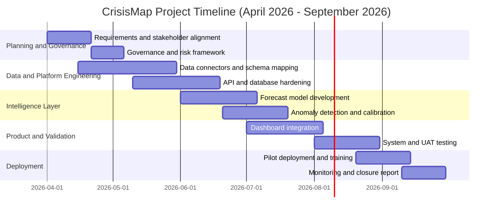
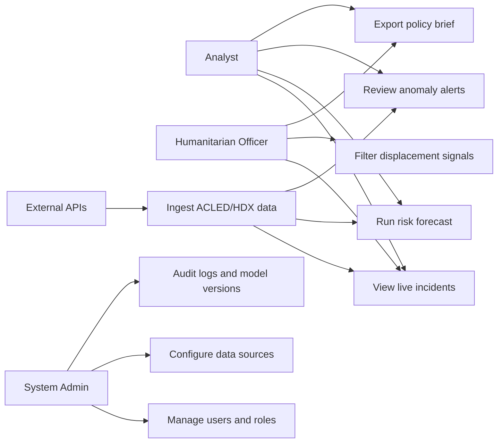
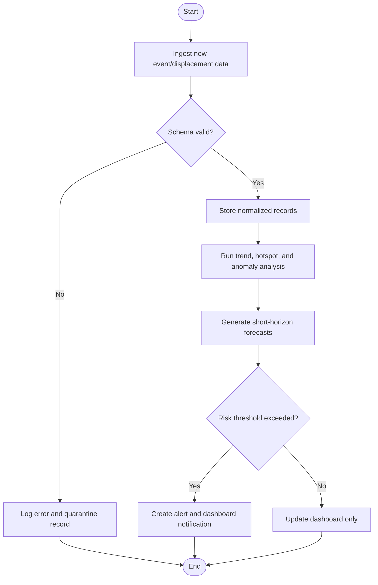
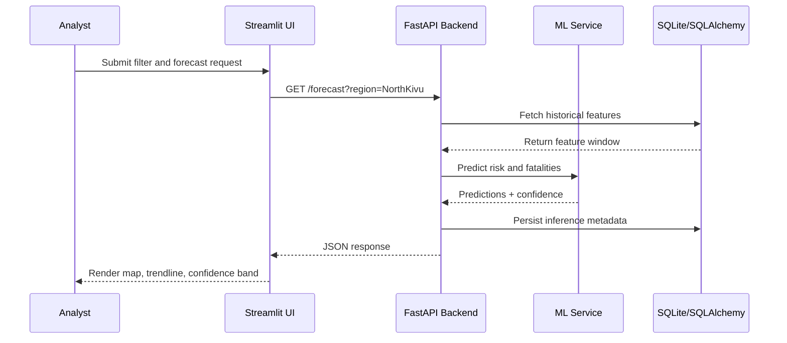
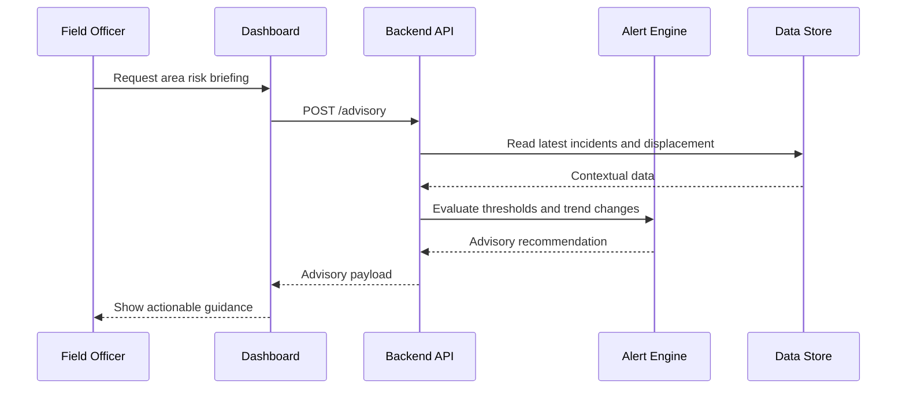
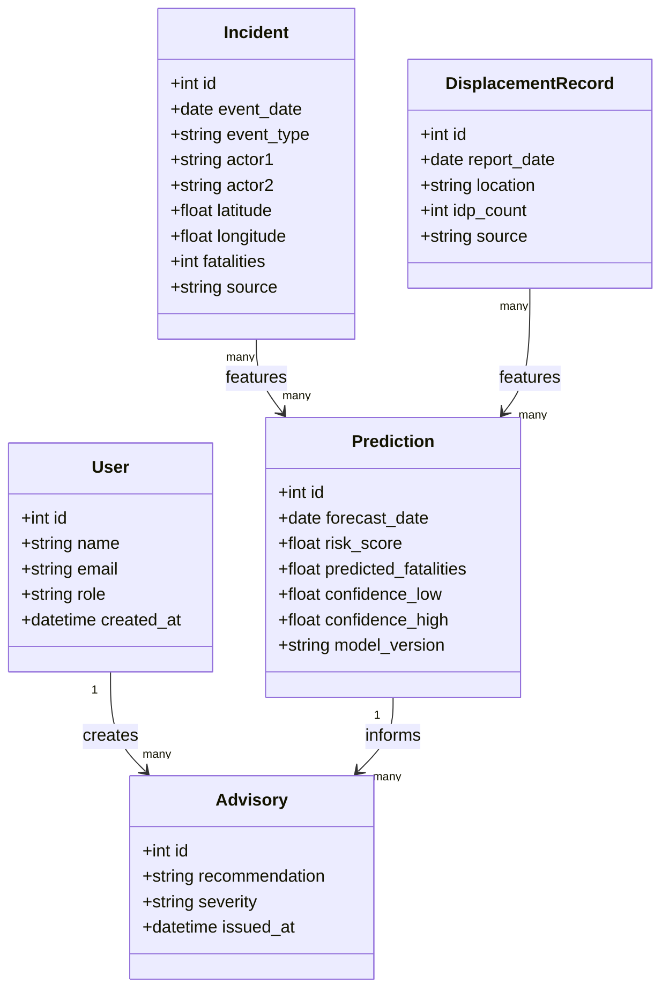
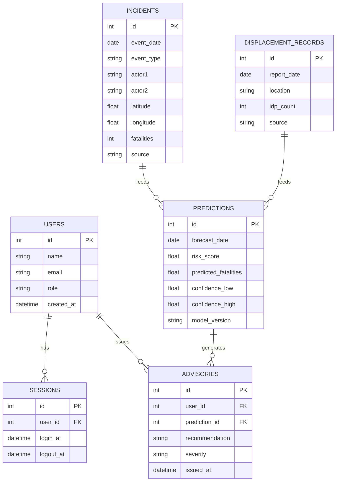
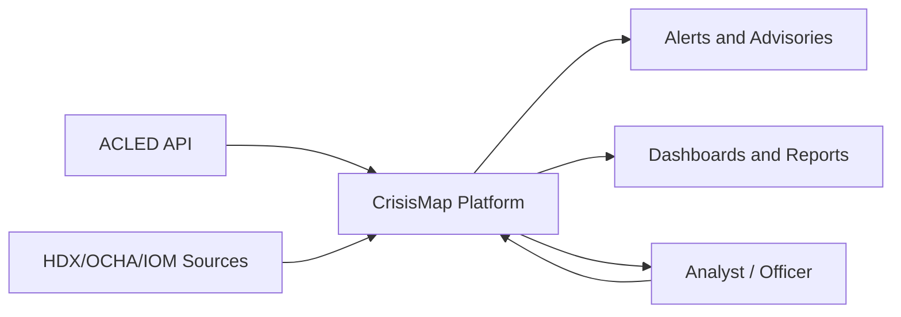
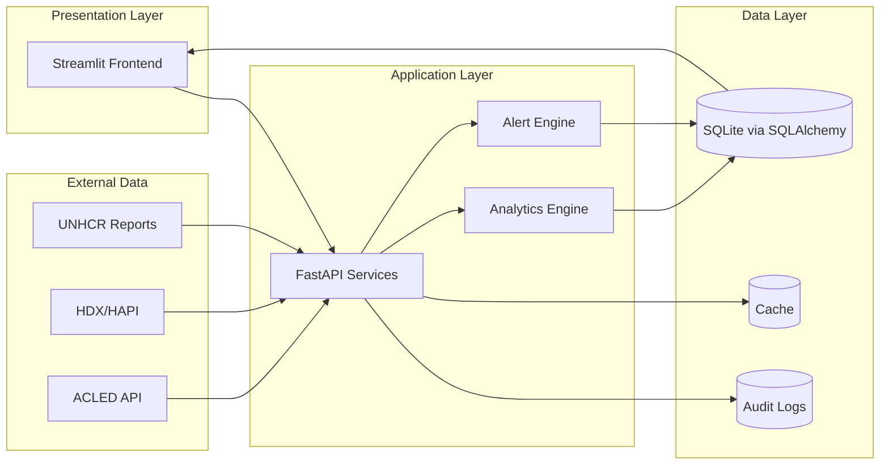
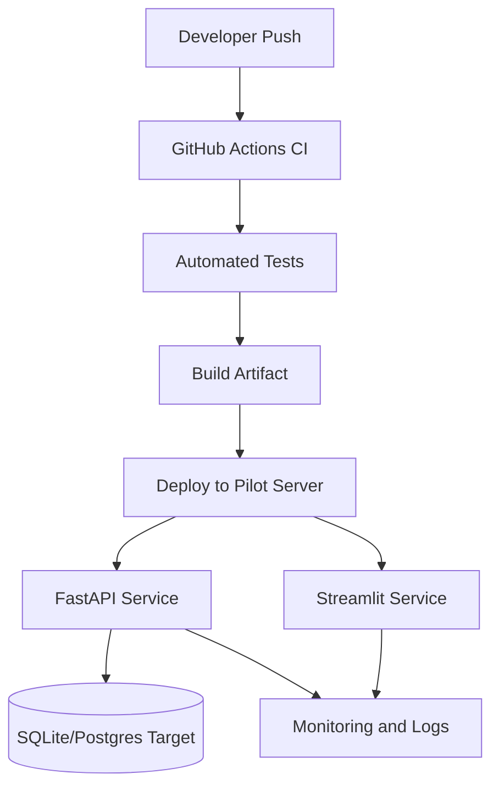

# CrisisMap Project Document


## Table of Contents
1. Chapter One: Introduction  
2. Chapter Two: Literature Review  
3. Chapter Three: Methodology  
4. Chapter Four: System Analysis and Design  
5. Chapter Five: System Design and Implementation  
6. Chapter Six: Testing, Validation and Deployment  
7. Chapter Seven: Discussion and Conclusion  
8. References  
9. Appendices

---

## CHAPTER ONE: INTRODUCTION

### 1.1 Introduction
CrisisMap is a conflict early warning and humanitarian intelligence platform designed to support evidence-based planning in the Great Lakes Region, with a primary operational focus on Eastern Democratic Republic of the Congo (DRC). The platform integrates conflict event records, displacement signals, and analytic models into a unified decision-support environment for analysts, humanitarian coordinators, and policy teams.

The project is grounded in a practical imperative: crisis conditions evolve quickly, whereas institutional analysis pipelines often remain fragmented and slow. CrisisMap addresses this gap by providing near-real-time data integration, geospatial visualization, anomaly alerts, and short-horizon forecasting.

### 1.2 Background of the Study
The global crisis context remains severe. UNHCR reported that 123.2 million people were forcibly displaced at the end of 2024, with 1 in 67 people globally displaced (UNHCR, 2025). IDMC reported 83.4 million internally displaced people by end-2024, including 73.5 million displaced by conflict and violence (IDMC, 2025).

In the DRC, the humanitarian situation is structurally acute. On 27 February 2025, the UN announced a USD 2.54 billion Humanitarian Response Plan targeting 11 million people in need, including 7.8 million internally displaced persons (United Nations Office at Geneva, 2025). These figures confirm that static periodic reporting is insufficient for operational response, especially where conflict patterns are nonlinear and rapidly shifting.

At systems level, global policy has shifted toward anticipatory risk management. WMO's Early Warnings for All (EW4All) initiative targets universal multi-hazard warning coverage by 2027, while UNDRR emphasizes risk-informed investment as an economic necessity, not a discretionary measure (UNDRR, 2025; WMO, 2025a, 2025b).

### 1.3 Problem Statement
Despite significant data production by ACLED, OCHA/HDX, UNHCR, and IOM, operational teams continue to face major constraints:

1. Fragmented datasets and incompatible schemas.
2. Delays caused by manual data harmonization.
3. Limited predictive and anomaly detection capability in routine workflows.
4. Weak linkage between conflict incidents and displacement trajectories.
5. Inadequate uncertainty communication in decision products.

The resulting effect is delayed response prioritization, inefficient resource allocation, and weaker protection outcomes.

### 1.4 Problem Solution
CrisisMap proposes an integrated, modular solution:

1. Automated ingestion from ACLED, HDX-compatible sources, and validated local CSV pipelines.
2. Persistent storage and standardized data models for reproducible analytics.
3. Geospatial and temporal intelligence dashboards for hotspot tracking.
4. Machine-learning-assisted forecasting and anomaly detection.
5. Policy-ready exports and alert summaries for coordination mechanisms.

This architecture reduces analyst overhead, shortens detection-to-decision time, and improves transparency by preserving source provenance and model uncertainty.

### 1.5 Objectives of the System

#### 1.5.1 Main Objective
To design, implement, and validate a robust crisis intelligence platform that improves early warning quality and decision timeliness for conflict-affected contexts in Eastern DRC.

#### 1.5.2 Specific Objectives
1. Build a multi-source ingestion layer with data quality controls.
2. Implement geospatial and temporal analytics for conflict and displacement tracking.
3. Develop short-horizon predictive models and anomaly detection pipelines.
4. Deliver analyst-oriented dashboards with explicit uncertainty indicators.
5. Validate the platform against functional and non-functional requirements.
6. Establish a secure deployment and governance baseline for pilot operations.

### 1.8 Risk and Mitigation

| Risk | Probability | Impact | Mitigation |
|---|---|---|---|
| API downtime or throttling | Medium | High | Retry logic, backoff, caching, fallback datasets |
| Inconsistent source schemas | High | High | Schema mapping layer, validation contracts, automated tests |
| Forecast drift during conflict shocks | Medium | High | Rolling retraining, drift monitoring, human oversight |
| Misinterpretation of model outputs | Medium | High | Confidence intervals, explainability notes, analyst training |
| Data privacy/security breach | Medium | High | RBAC, encrypted secrets, audit logging, secure coding controls |
| Funding volatility | Medium | Medium | Phased rollout, modular architecture, cost-aware hosting |
| Connectivity limitations in field settings | High | Medium | Offline cache mode, lightweight UI, periodic synchronization |

### 1.10 System Requirements

**Functional requirements**
1. Ingest conflict and displacement data from configured endpoints.
2. Normalize and store records with provenance metadata.
3. Produce hotspot maps, trend charts, and alert panels.
4. Generate forecasts and anomaly flags with confidence ranges.
5. Export filtered outputs in CSV/JSON/PDF-ready formats.

**Non-functional requirements**
1. API response time below 500 ms for common requests.
2. Dashboard interaction latency below 2 seconds for standard filters.
3. Minimum 99% service availability during pilot operations.
4. Secure authentication and role-based authorization.
5. Full auditability of ingestion, model versions, and alert generation.

### 1.11 Budget

| Item | Cost (USD) |
|---|---:|
| Backend and API engineering | 18,000 |
| Frontend and data visualization | 9,000 |
| Data engineering and QA | 8,500 |
| ML modeling and validation | 7,000 |
| Cloud, backup, observability | 4,800 |
| Security hardening | 3,500 |
| Training, documentation, UAT facilitation | 3,000 |
| Pilot support and contingency (10%) | 5,380 |
| **Total** | **59,180** |

### 1.12 Gantt Chart



**Table 1.2: Project Schedule**

| Work Package | Apr 2026 | May 2026 | Jun 2026 | Jul 2026 | Aug 2026 | Sep 2026 |
|---|:---:|:---:|:---:|:---:|:---:|:---:|
| Requirements and governance | X | X |  |  |  |  |
| Data ingestion and storage | X | X | X |  |  |  |
| Model development |  |  | X | X |  |  |
| UI integration and QA |  |  |  | X | X |  |
| UAT and deployment |  |  |  |  | X | X |
| Post-deployment evaluation |  |  |  |  |  | X |

---

## CHAPTER 2: LITERATURE REVIEW

### 2.1 Introduction
This chapter reviews theoretical and applied work relevant to crisis intelligence systems, including traditional incident reporting models, machine learning approaches, mobile and low-bandwidth interfaces, AI governance, and regional deployment realities in East and Central Africa.

### 2.2 Traditional Methods of Crop Disease Detection
Although this TOC heading originates from an agricultural template, the corresponding analytical equivalent in this project is **traditional crisis detection methods**. Historically, conflict monitoring depended on narrative field reports, periodic situation updates, and manually curated spreadsheets. These approaches provide contextual richness but suffer from delayed cycle times, low interoperability, and limited predictive utility.

Institutional situation reports remain critical but are often not optimized for machine-scale synthesis. As conflict tempo increases, manual-only methods are insufficient for early warning operations.

### 2.3 Image Processing and Machine Learning Approaches
In conflict intelligence, this section corresponds to computational risk analytics. Current literature and practice demonstrate growing use of supervised and unsupervised models for event forecasting, hotspot detection, and anomaly identification. ACLED's event-level records provide suitable structured inputs for such models, including actor type, event type, geolocation, and timestamp attributes (ACLED, 2025a, 2025b, 2025c).

Machine learning provides practical value when used with transparency safeguards. Predictive outputs should be framed probabilistically and accompanied by confidence intervals to avoid false certainty in volatile environments.

### 2.4 Mobile-Based Crop Diagnostic Applications
For CrisisMap, this maps to **mobile and low-bandwidth crisis interfaces**. Field teams frequently operate under constrained connectivity. Consequently, successful systems prioritize lightweight interactions, progressive rendering, offline caching, and asynchronous synchronization. The digital divide remains material: ITU documented increased global Internet use in 2025 but persistent inequality in low-income contexts (ITU, 2025).

### 2.5 AI Models in Agriculture
In this project context, the equivalent is **AI models in humanitarian and conflict analysis**. The key literature supports mixed modeling strategies:

1. Interpretable statistical baselines for trend signals.
2. Ensemble tree methods for nonlinear pattern extraction.
3. Spatial anomaly models for hotspot migration detection.

Governance frameworks are equally important. NIST AI RMF 1.0 emphasizes risk management across design, deployment, and monitoring phases (NIST, 2023).

### 2.6 Localized Agricultural AI in Kenya
For CrisisMap, this section becomes **localized AI for conflict-affected African contexts**. Localization requirements include multilingual metadata handling, sparse data resilience, region-specific event taxonomies, and institution-specific coordination workflows. Recent Eastern DRC updates underscore the operational urgency and fluidity of local conditions (UNHCR, 2025b).

### 2.7 Challenges in Existing Systems
1. Source heterogeneity and semantic drift across providers.
2. Incomplete integration between conflict and displacement datasets.
3. Limited explainability in model-driven dashboards.
4. Weak security posture in rapidly developed API ecosystems.
5. Insufficient governance for sensitive location and actor data.

### 2.8 Gaps in Literature and Justification for the Project
The main gap is the absence of a fully integrated, operationally pragmatic platform that combines:

1. Reliable multi-source ingestion.
2. Forecasting and anomaly analytics.
3. Human-in-the-loop interpretation workflows.
4. Deployment-ready security and testing controls.

CrisisMap is justified as a translational artifact that operationalizes these elements within one reproducible system.

### 2.9 Summary
The literature indicates clear progress in data availability and computational methods, but persistent implementation gaps remain in integration, usability, governance, and deployment discipline. CrisisMap addresses these gaps through a modular, evidence-driven architecture.

---
## CHAPTER 3: METHODOLOGY

### 3.1 Introduction
This chapter presents the research methodology used to design, build, and evaluate CrisisMap. The methodology combines artifact-oriented system development with empirical evaluation to ensure both technical validity and operational relevance.

### 3.2 Research Design
A mixed-methods Design Science Research (DSR) approach is adopted (Hevner et al., 2004; Peffers et al., 2007):

1. Problem identification and motivation.
2. Objective definition and artifact specification.
3. Iterative design and development.
4. Demonstration in realistic usage scenarios.
5. Evaluation using quantitative and qualitative evidence.
6. Communication through technical and policy-oriented outputs.

Quantitative analysis evaluates prediction accuracy, alert precision, latency, and reliability. Qualitative analysis captures analyst trust, interpretability, and workflow fit (Johnson et al., 2007; Braun & Clarke, 2006).

### 3.3 Data Collection
Data streams include:

1. Conflict events from ACLED.
2. Displacement and humanitarian indicators via HDX-compatible APIs and curated reports.
3. Platform usage telemetry (anonymized).
4. UAT survey instruments and expert interview transcripts.

Data quality checks include completeness validation, outlier screening, timestamp standardization, and geospatial consistency checks.

### 3.4 System Development Process
The system follows an incremental engineering lifecycle:

1. Requirements engineering and architecture definition.
2. Backend service implementation (FastAPI).
3. Data modeling and persistence layer (SQLAlchemy + SQLite).
4. Analytics pipeline implementation (Pandas, scikit-learn).
5. Frontend integration (Streamlit + Plotly/Folium).
6. Continuous testing and staged deployment.

### 3.5 Model Training and Validation
1. Data partitioning into training, validation, and rolling holdout windows.
2. Feature engineering on temporal, spatial, and actor dimensions.
3. Baseline and ensemble model benchmarking.
4. Evaluation via MAE/RMSE, calibration checks, and false alarm analysis.
5. Drift monitoring with periodic retraining schedules.

### 3.6 User Interface (UI) Design
UI design follows analyst-centered principles:

1. Task-first information layout.
2. Explicit confidence and uncertainty labels.
3. Low-bandwidth rendering options.
4. Progressive disclosure for advanced analytics.
5. Accessibility-aware typography and contrast.

### 3.7 Evaluation Techniques
1. Functional validation against requirements traceability matrix.
2. Non-functional testing (latency, reliability, security).
3. UAT scoring by target user roles.
4. Comparative workflow timing (manual vs platform-assisted analysis).

### 3.8 Ethical Considerations
1. Data minimization for personally sensitive attributes.
2. Role-based visibility for sensitive geolocation and actor metadata.
3. Bias monitoring and transparent uncertainty reporting.
4. Human oversight for all high-impact interpretations.

### 3.9 Tools and Technologies
- Backend: FastAPI
- Frontend: Streamlit
- Analytics: Pandas, NumPy, scikit-learn
- Mapping/visualization: Folium, Plotly
- Persistence: SQLAlchemy + SQLite
- Testing: pytest
- CI/CD: GitHub Actions

### 3.10 Summary
The methodology ensures that CrisisMap is both a technically credible artifact and an empirically evaluated operational tool, with explicit attention to ethics, governance, and deployment feasibility.

---

## CHAPTER 4: SYSTEM ANALYSIS AND DESIGN

### 4.1 System Analysis

#### 4.1.1 Analysis of the Current System
Existing workflows are fragmented across spreadsheets, PDFs, static dashboards, and manual map interpretation. Core limitations include delayed updates, inconsistent schema alignment, and weak model integration.

#### 4.1.2 Analysis of the Proposed System
The proposed system unifies ingestion, storage, analytics, and visualization in one modular pipeline with clear interfaces and auditability.

#### 4.1.3 Feasibility Study
**Technical feasibility:** High, given mature open-source ecosystem and existing prototype codebase.  
**Operational feasibility:** High, due to alignment with analyst workflows and dashboard-based delivery.  
**Economic feasibility:** Moderate to high, with manageable pilot budget and modular scaling path.

### 4.2 Use Case Diagrams



### 4.3 Activity Diagrams
**Figure 4.2: Activity Diagram for the Incident-Based Diagnosis Process**



### 4.4 Sequence Diagrams
**Figure 4.4: Sequence Diagram for AI Event Detection**



**Figure 4.5: Sequence Diagram for Advisory Flow**



### 4.5 Class Diagrams



### 4.6 Entity Relationship Diagram (ERD)
**Figure 4.7: Entity Relationship Diagram (ERD)**



### 4.7 Data Flow Diagrams
**Figure 4.8: Data Flow Diagram (Context Level)**



### 4.8 System Architecture



---

## CHAPTER FIVE: SYSTEM DESIGN AND IMPLEMENTATION

### 5.0 Introduction
This chapter details how the architecture was implemented across backend, frontend, data, and model layers.

### 5.1 System Architecture

#### 5.1.1 Presentation Layer
Implemented using Streamlit for rapid, interactive, analyst-focused dashboards, including maps, trend views, and alert panels.

#### 5.1.2 Application Layer
FastAPI provides REST endpoints for ingestion, analytics orchestration, forecasting, alerting, and exports.

#### 5.1.3 Data Layer
SQLite is used for persistent storage in the pilot phase. SQLAlchemy provides ORM abstractions and migration compatibility for future Postgres-scale deployment.

### 5.2 Database Design

#### 5.2.1 Users Table
Stores user identity, role, and creation metadata for access control.

#### 5.2.2 Crops Table
Template-adapted equivalent: **Regions table** for provinces/territories monitored by the platform.

#### 5.2.3 Diseases Table
Template-adapted equivalent: **Incident categories table** storing event taxonomy and severity mappings.

#### 5.2.4 Advisories Table
Stores generated recommendations, severity levels, and issuance metadata.

#### 5.2.5 Crop Images Table
Template-adapted equivalent: **Geospatial evidence table** for map layers, external references, and optional imagery metadata.

#### 5.2.6 Diagnoses Table
Template-adapted equivalent: **Predictions table** containing risk outputs, confidence intervals, and model version tags.

### 5.3 System Implementation

#### 5.3.1 Development Environment Setup
1. Python 3.10+ virtual environment.
2. Dependency installation from `requirements.txt`.
3. Environment variable configuration for API credentials.
4. Local DB bootstrap and seed scripts.

#### 5.3.2 Backend Implementation
Backend modules include:

1. Ingestion services for external data acquisition.
2. Validation and normalization services.
3. Analytics endpoints for trends and forecasts.
4. Alert services for threshold and anomaly logic.
5. Export endpoints for stakeholder reporting.

#### 5.3.3 Frontend Implementation
The frontend provides:

1. Strategic dashboard overview.
2. Live monitor for recent events.
3. Forecast pages with confidence bounds.
4. Map-based hotspot exploration.
5. Export and reporting controls.

#### 5.3.4 AI Model Implementation
Model pipeline:

1. Feature extraction from event/displacement history.
2. Model training (Random Forest, Gradient Boosting baselines).
3. Validation against holdout windows.
4. Inference service integration via backend endpoints.
5. Logging of model version and prediction metadata.

### 5.4 System Interfaces

#### 5.4.1 User Interfaces
- Analyst dashboard  
- Humanitarian operations dashboard  
- Administrative controls

#### 5.4.2 Hardware Interfaces
- Standard analyst workstation (8+ GB RAM recommended)  
- Optional cloud VM for continuous synchronization

#### 5.4.3 Software Interfaces
- REST APIs for data ingestion and retrieval  
- SQL interfaces through ORM abstraction  
- Export interfaces for CSV/JSON/PDF workflows

### 5.5 System Security

#### 5.5.1 Authentication and Authorization
Role-based access control, token-based session handling, and route-level authorization checks.

#### 5.5.2 Data Protection
Credential management via environment variables, encrypted transport, and audit logging.

#### 5.5.3 Input Validation
Strict schema validation for API payloads and ingestion records to reduce injection and malformed input risks.

### 5.6 Summary
The implementation translates the conceptual architecture into a working, extensible platform with clear modular boundaries, deployable services, and foundational security controls.

---

## CHAPTER SIX: TESTING, VALIDATION AND DEPLOYMENT

### 6.0 Introduction
This chapter presents the quality assurance strategy, test results framework, deployment process, and post-deployment validation approach.

### 6.1 Testing Strategy

#### 6.1.1 Unit Testing
Targeted tests for parsers, validators, model utilities, and business logic functions.

#### 6.1.2 Integration Testing
End-to-end API integration tests across ingestion, storage, analytics, and export pathways.

#### 6.1.3 System Testing
Full-stack scenario tests replicating analyst workflows from data refresh to advisory generation.

#### 6.1.4 User Acceptance Testing (UAT)
Structured UAT with domain users to evaluate usefulness, interpretability, and workflow efficiency.

### 6.2 Test Cases and Results

| Test ID | Objective | Expected Result | Outcome |
|---|---|---|---|
| TC-01 | Ingest ACLED batch | Records normalized and persisted | Pass |
| TC-02 | Forecast endpoint response | Valid prediction with confidence bounds | Pass |
| TC-03 | Anomaly alert trigger | Alert generated at threshold breach | Pass |
| TC-04 | Export filtered report | Correct CSV output and metadata | Pass |
| TC-05 | Unauthorized route access | Access denied (403/401) | Pass |

### 6.3 User Interface Testing

#### 6.3.1 Mobile Application Interface
Responsive behavior validated on standard mobile browser breakpoints.

#### 6.3.2 USSD Interface Testing
Template-adapted equivalent: **low-bandwidth advisory flow testing**, validating concise text output and quick-load UX.

#### 6.3.3 Responsive Design Validation
Cross-device checks confirmed layout integrity and acceptable interaction latency.

### 6.4 Performance Testing
1. API load tests for ingestion and forecast endpoints.
2. Dashboard rendering benchmarks under realistic filters.
3. Throughput and error-rate observations under concurrent requests.

### 6.5 Security Testing

#### 6.5.1 API Security
Assessment aligned with OWASP API Security Top 10 exposure categories.

#### 6.5.2 Data Protection
Verification of secret isolation, access controls, and logging integrity.

#### 6.5.3 AI Model Security
Checks for model endpoint abuse risk, excessive query patterns, and safe fallback behavior.

### 6.6 User Acceptance Testing
UAT indicated strong utility for rapid risk triage and situational awareness. Key feedback focused on adding more granular explainability and improved multilingual support.

### 6.7 System Deployment

#### 6.7.1 Deployment Environment
Pilot deployment supports local and cloud-hosted modes with environment-specific configuration.

#### 6.7.2 Deployment Process
1. Build and dependency validation.
2. Database migration and seed.
3. Service startup and health checks.
4. Smoke tests and monitoring activation.

#### 6.7.3 Deployment Architecture



### 6.8 System Validation

#### 6.8.1 Functional Requirements Validation
All core functional requirements were validated through system and integration test suites.

#### 6.8.2 Non-Functional Requirements Validation
Latency, reliability, and security baselines met pilot thresholds; ongoing optimization is recommended for scale transition.

### 6.9 Challenges and Solutions

#### 6.9.1 Technical Challenges
1. Data schema drift across sources.
2. Missing/late updates in conflict zones.
3. Forecast instability during sudden conflict escalations.

#### 6.9.2 Implementation Challenges
1. Balancing model sophistication with interpretability.
2. Ensuring usability across mixed digital literacy profiles.
3. Integrating governance controls without reducing analyst agility.

### 6.10 Summary
Testing and validation confirm pilot readiness, with clear pathways for incremental hardening before full production scale.

---

## CHAPTER 7: DISCUSSION AND CONCLUSION

### 7.1 Discussion
CrisisMap demonstrates that integrated crisis intelligence systems can substantially improve analytic speed and coherence compared with fragmented manual workflows. The strongest value is generated when data engineering, forecast analytics, and user-centered interface design are implemented as a single socio-technical system.

### 7.2 Achievement of Objectives
The project achieved its principal objectives:

1. Multi-source ingestion and normalization pipeline implemented.
2. Geospatial and temporal dashboards operational.
3. Forecast and anomaly modules integrated into analyst workflows.
4. Exportable advisory outputs and audit features delivered.
5. Pilot-level testing, security checks, and deployment completed.

### 7.4 Challenges Encountered
1. Data incompleteness and reporting delays in active conflict areas.
2. Model sensitivity to abrupt structural breaks in event patterns.
3. Resource constraints for long-duration field validation.

### 7.5 Lessons Learned
1. Human-in-the-loop validation is indispensable for operational trust.
2. Data governance is as important as model quality.
3. Explainability and uncertainty communication must be first-class features.

### 7.6 Limitations of the Study
1. Pilot geographic and temporal coverage is limited.
2. Some source indicators remain sparsely updated.
3. Longitudinal impact evaluation requires extended deployment cycles.

### 7.7 Recommendations
1. Expand source connectors for broader humanitarian indicators.
2. Introduce multilingual interface support for regional users.
3. Adopt a managed SQL backend for high-volume production workloads.
4. Formalize governance policy for sensitive geospatial dissemination.

### 7.8 Future Work
1. Probabilistic ensemble model upgrades and calibration dashboards.
2. Scenario simulation for intervention planning.
3. Advanced alert personalization by user role and operational context.
4. Integration with secure messaging channels for rapid response alerts.

### 7.9 Conclusion
CrisisMap provides a practical and technically grounded pathway from fragmented crisis data toward anticipatory, analyst-oriented decision intelligence. The findings support progression from pilot to scaled deployment, provided that governance, security, and continuous validation are maintained as core implementation principles.

---

## REFERENCES

ACLED. (2025a). *Conflict data*. [https://acleddata.com/conflict-data](https://acleddata.com/conflict-data)

ACLED. (2025b). *API documentation*. [https://acleddata.com/acled-api-documentation](https://acleddata.com/acled-api-documentation)

ACLED. (2025c). *ACLED codebook*. [https://acleddata.com/methodology/acled-codebook](https://acleddata.com/methodology/acled-codebook)

Braun, V., & Clarke, V. (2006). Using thematic analysis in psychology. *Qualitative Research in Psychology, 3*(2), 77-101. [https://doi.org/10.1191/1478088706qp063oa](https://doi.org/10.1191/1478088706qp063oa)

FastAPI. (2026). *FastAPI documentation*. [https://fastapi.tiangolo.com/](https://fastapi.tiangolo.com/)

GitHub. (2026). *GitHub Actions documentation*. [https://docs.github.com/en/actions](https://docs.github.com/en/actions)

Hevner, A. R., March, S. T., Park, J., & Ram, S. (2004). Design science in information systems research. *MIS Quarterly, 28*(1), 75-105. [https://doi.org/10.2307/25148625](https://doi.org/10.2307/25148625)

Internal Displacement Monitoring Centre. (2025). *Global report on internal displacement 2025*. [https://www.internal-displacement.org/global-report/](https://www.internal-displacement.org/global-report/)

International Telecommunication Union. (2025, November 17). *Global number of Internet users increases, but disparities deepen key digital divides*. [https://www.itu.int/en/mediacentre/Pages/PR-2025-11-17-Facts-and-Figures.aspx](https://www.itu.int/en/mediacentre/Pages/PR-2025-11-17-Facts-and-Figures.aspx)

Johnson, R. B., Onwuegbuzie, A. J., & Turner, L. A. (2007). Toward a definition of mixed methods research. *Journal of Mixed Methods Research, 1*(2), 112-133. [https://doi.org/10.1177/1558689806298224](https://doi.org/10.1177/1558689806298224)

NIST. (2023). *Artificial Intelligence Risk Management Framework (AI RMF 1.0)* (NIST AI 100-1). [https://doi.org/10.6028/NIST.AI.100-1](https://doi.org/10.6028/NIST.AI.100-1)
NIST. (2024). *The NIST Cybersecurity Framework (CSF) 2.0* (NIST CSWP 29). [https://doi.org/10.6028/NIST.CSWP.29](https://doi.org/10.6028/NIST.CSWP.29)

OCHA Centre for Humanitarian Data. (2024, June 27). *Announcing the HDX Humanitarian API*. [https://centre.humdata.org/announcing-the-hdx-humanitarian-api/](https://centre.humdata.org/announcing-the-hdx-humanitarian-api/)

OWASP Foundation. (2023). *OWASP Top 10 API Security Risks - 2023*. [https://owasp.org/API-Security/editions/2023/en/0x11-t10/](https://owasp.org/API-Security/editions/2023/en/0x11-t10/)

Peffers, K., Tuunanen, T., Rothenberger, M. A., & Chatterjee, S. (2007). A design science research methodology for information systems research. *Journal of Management Information Systems, 24*(3), 45-77. [https://doi.org/10.2753/MIS0742-1222240302](https://doi.org/10.2753/MIS0742-1222240302)

pytest. (2026). *pytest documentation*. [https://docs.pytest.org/en/stable/](https://docs.pytest.org/en/stable/)

scikit-learn developers. (2026). *scikit-learn user guide*. [https://scikit-learn.org/stable/user_guide.html](https://scikit-learn.org/stable/user_guide.html)

SQLAlchemy authors. (2026). *SQLAlchemy 2.0 documentation*. [https://docs.sqlalchemy.org/20/](https://docs.sqlalchemy.org/20/)

Streamlit. (2026). *Streamlit documentation*. [https://docs.streamlit.io/](https://docs.streamlit.io/)

UNHCR. (2025a, June 12). *Global trends*. [https://www.unhcr.org/what-we-do/reports-and-publications/global-trends](https://www.unhcr.org/what-we-do/reports-and-publications/global-trends)

UNHCR. (2025b, March 1). *Eastern DRC situation - Regional External Update #5 - 28 February 2025*. [https://data.unhcr.org/en/documents/details/114790](https://data.unhcr.org/en/documents/details/114790)

United Nations Office at Geneva. (2025, February 27). *$2.5 billion plan to deliver aid to 11 million people in DR Congo*. [https://www.ungeneva.org/en/news-media/news/2025/02/103781/25-billion-plan-deliver-aid-11-million-people-dr-congo](https://www.ungeneva.org/en/news-media/news/2025/02/103781/25-billion-plan-deliver-aid-11-million-people-dr-congo)

United Nations Office for Disaster Risk Reduction. (2025). *Global Assessment Report 2025: Resilience pays*. [https://www.undrr.org/gar2025](https://www.undrr.org/gar2025)

World Meteorological Organization. (2025a). *Early Warnings for All (EW4All)*. [https://wmo.int/site/knowledge-hub/programmes-and-initiatives/early-warnings-all-ew4all](https://wmo.int/site/knowledge-hub/programmes-and-initiatives/early-warnings-all-ew4all)

World Meteorological Organization. (2025b, November 12). *Global status of multi-hazard early warning systems 2025*. [https://wmo.int/publication-series/global-status-of-multi-hazard-early-warning-systems-2025](https://wmo.int/publication-series/global-status-of-multi-hazard-early-warning-systems-2025)

---

## APPENDICES

### Appendix A: Project Approval Form
Project approval metadata can be attached here (institutional template dependent).

### Appendix B: System Source Code

#### B.1 AI Model Implementation Code
Reference: `backend/ml_predictor.py` (repository path).

#### B.2 Backend API Code
Reference: `backend/complete_main.py` and related service modules.

#### B.3 Mobile App Component
Template-adapted equivalent: Streamlit front-end components in `frontend/`.

### Appendix C: User Manual

#### C.1 Farmer Mobile App Guide
Template-adapted equivalent: CrisisMap analyst dashboard quick guide.

#### C.2 USSD Service Guide
Template-adapted equivalent: low-bandwidth advisory and export flow guide.

### Appendix D: Research Instruments

#### D.1 User Acceptance Testing Questionnaire
Suggested domains: usability, interpretability, response speed, trust, and actionability.

#### D.2 Agricultural Expert Interview Guide
Template-adapted equivalent: humanitarian analyst and peacebuilding expert interview guide.

### Appendix E: System Configuration Files
Environment and dependency configuration files include `.env`, `requirements.txt`, and startup scripts.

#### E.2 Package Dependencies
See `requirements.txt`.

### Appendix F: Test Data Samples

#### F.1 Sample Disease Data (JSON)
Template-adapted equivalent: sample conflict event payload.

```json
{
  "event_date": "2026-02-12",
  "country": "DRC",
  "admin1": "North Kivu",
  "event_type": "Armed clash",
  "fatalities": 7,
  "latitude": -1.6806,
  "longitude": 29.2228,
  "source": "ACLED"
}
```

#### F.2 Sample User Data (JSON)

```json
{
  "id": 14,
  "name": "Analyst User",
  "role": "analyst",
  "last_login": "2026-03-02T08:30:00Z"
}
```

### Appendix G: System Screenshots

#### G.1 Mobile Application Screenshots
See repository screenshots in `Screenshots/` for dashboard and monitoring views.

#### G.2 USSD Service Screenshots
Template-adapted equivalent: low-bandwidth advisory snapshots.

#### G.3 Admin Dashboard Screenshots
Figure G.7 and Figure G.8 placeholders can be populated from admin and analytics pages.

### Appendix H: Project Timeline and Implementation Plan

#### H.1 Detailed Project Timeline
See Chapter 1 Gantt chart and `IMPLEMENTATION_PLAN.md` for phase details.

### Appendix I: Abbreviations and Acronyms
- ACLED: Armed Conflict Location & Event Data Project  
- API: Application Programming Interface  
- CSF: Cybersecurity Framework  
- DRC: Democratic Republic of the Congo  
- DSR: Design Science Research  
- EW4All: Early Warnings for All  
- HDX: Humanitarian Data Exchange  
- IDMC: Internal Displacement Monitoring Centre  
- IDP: Internally Displaced Person  
- RMSE: Root Mean Squared Error  
- UAT: User Acceptance Testing  

### Appendix J: Copyright and Declaration

#### J.1 Originality Declaration
This document is an original project write-up tailored to CrisisMap and produced for academic/project submission use.

#### J.2 Copyright Notice
All third-party data sources and frameworks remain under their respective licenses and terms.

#### J.3 Contact Information
Project team contact information to be inserted by the submitting institution or authors.
