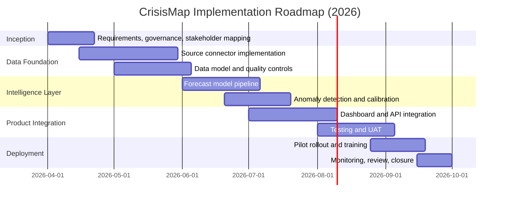
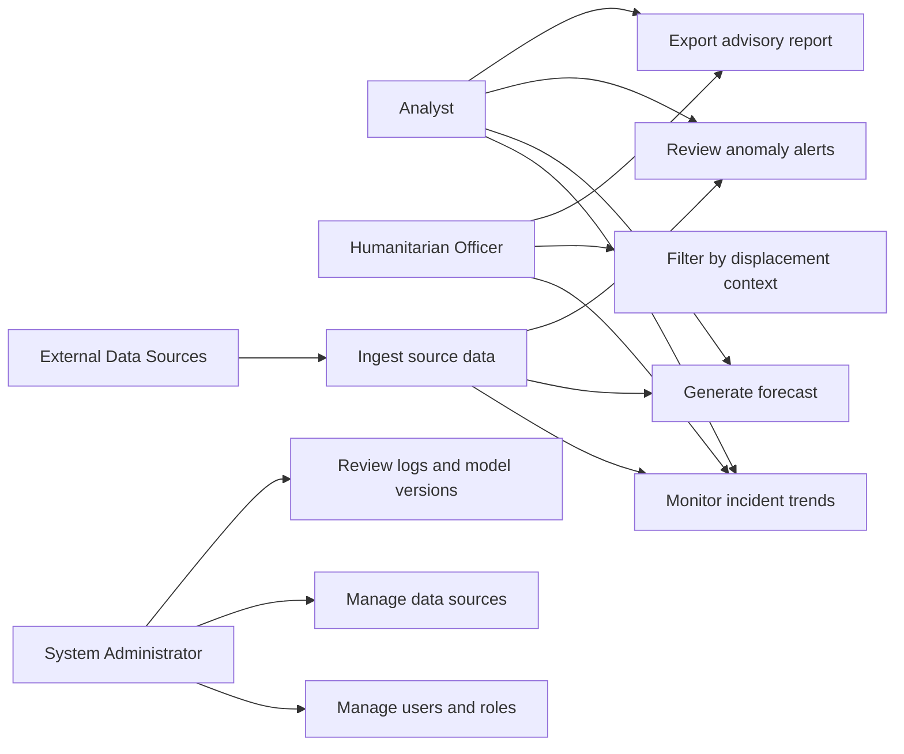
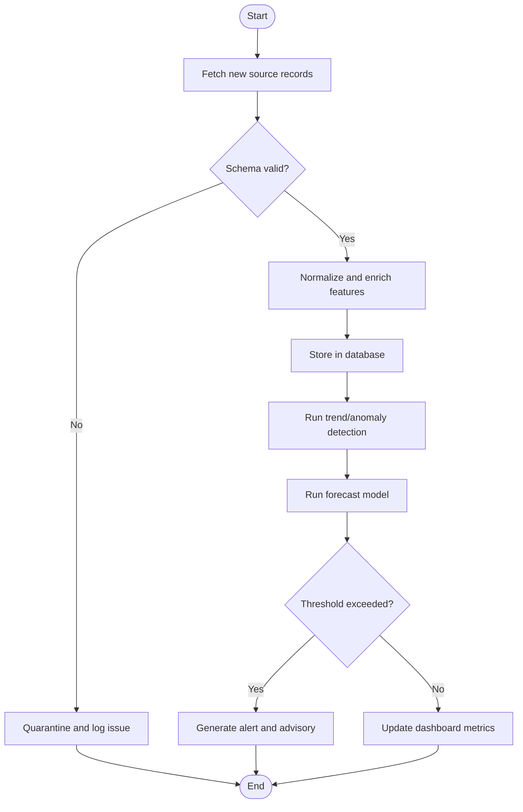
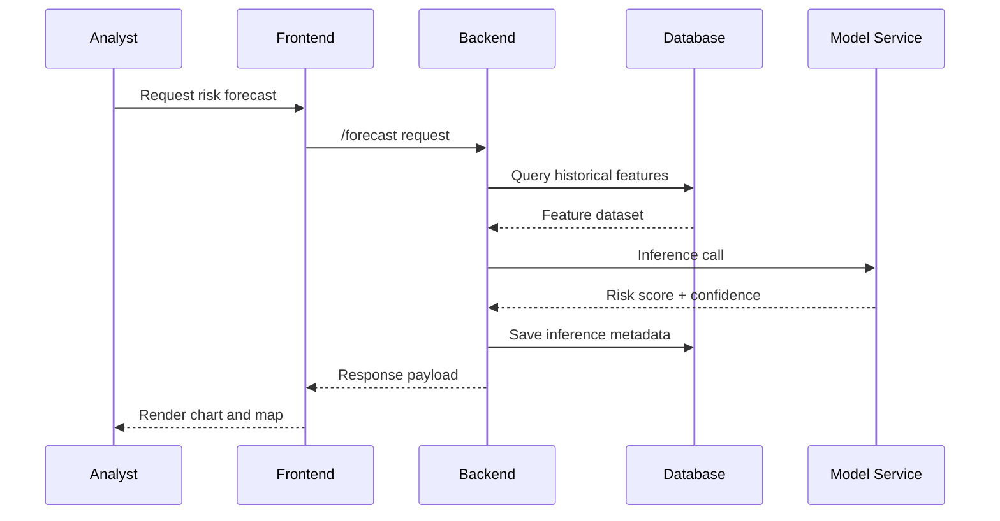
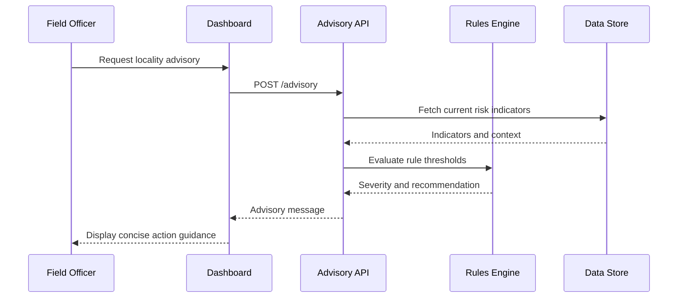
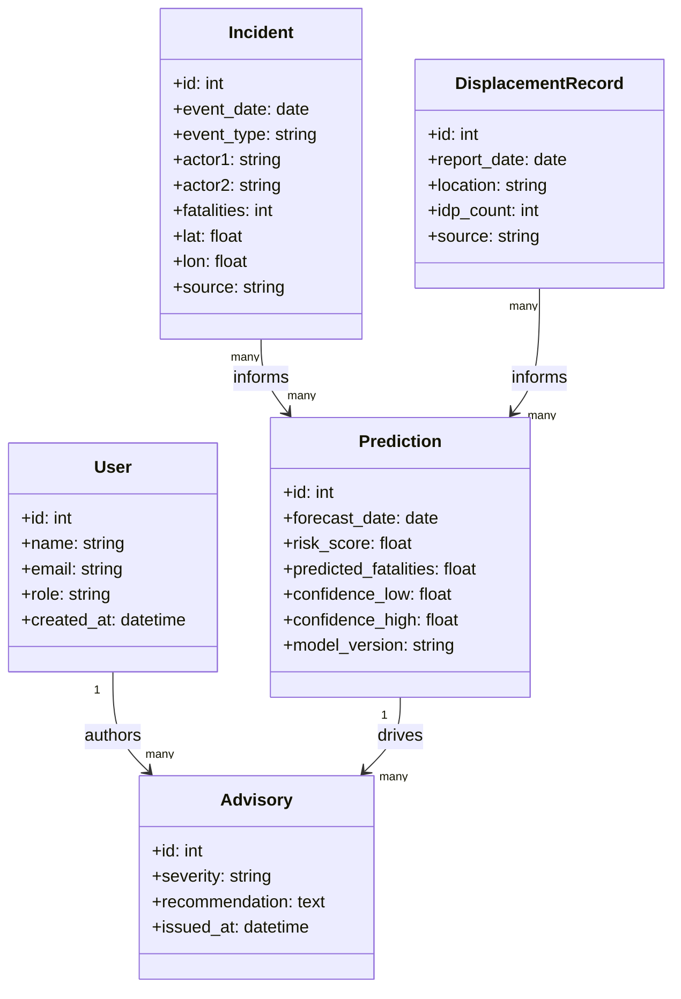
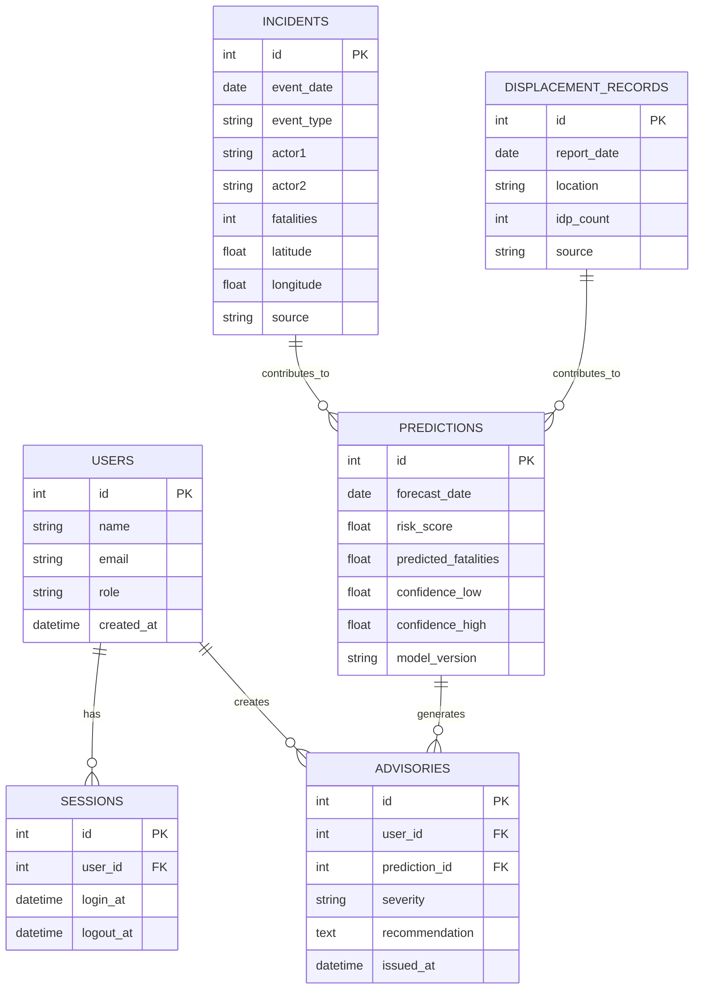
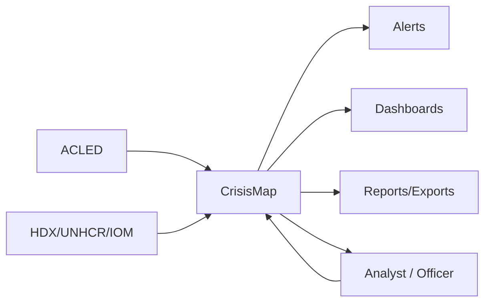
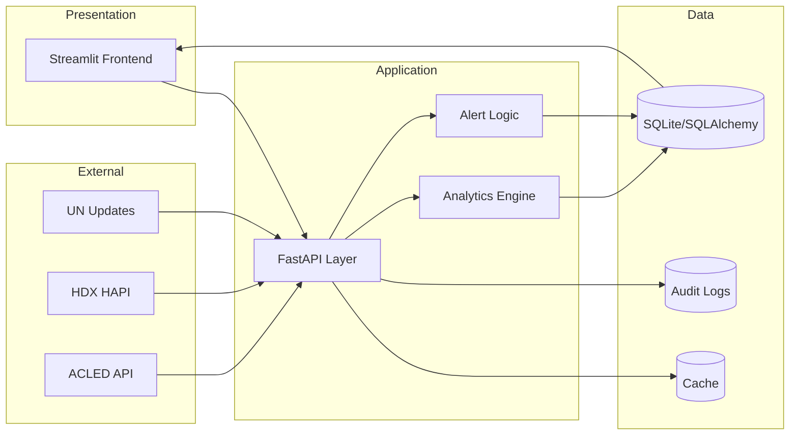
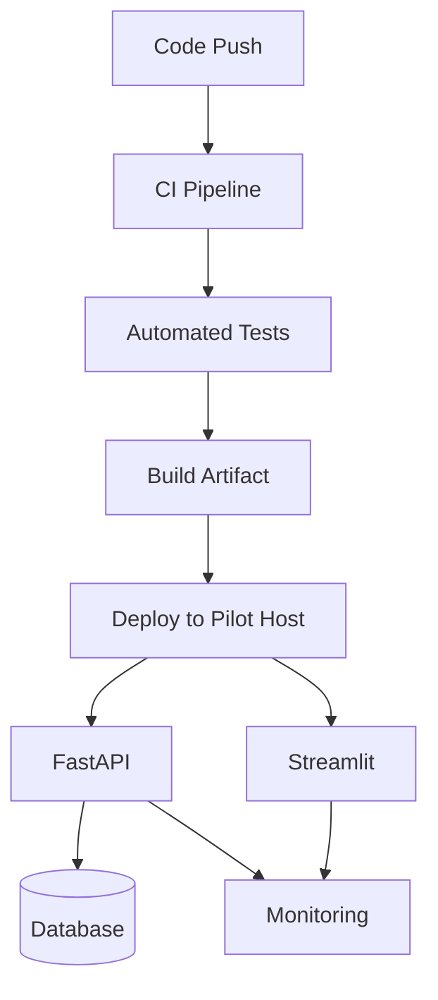

# CrisisMap: Full Project Proposal and Technical Report (Detailed Academic Edition)

## Table of Contents
CHAPTER ONE: INTRODUCTION  
1.1 Introduction  
1.2 Background of the Study  
1.3 Problem Statement  
1.4 Problem Solution  
1.5 Objectives of the System  
1.5.1 Main Objective  
1.5.2 Specific Objectives  
1.8 Risk and Mitigation  
1.10 System Requirements  
1.11 Budget  
1.12 Gantt Chart  
Table 1.2: Project Schedule  
CHAPTER 2: LITERATURE REVIEW  
2.1 Introduction  
2.2 Traditional Methods of Crop Disease Detection (Template-Adapted to Traditional Crisis Detection)  
2.3 Image Processing and Machine Learning Approaches (Template-Adapted to Crisis Analytics)  
2.4 Mobile-Based Crop Diagnostic Applications (Template-Adapted to Low-Bandwidth Crisis Interfaces)  
2.5 AI Models in Agriculture (Template-Adapted to Humanitarian and Conflict Intelligence)  
2.6 Localized Agricultural AI in Kenya (Template-Adapted to Localized AI in Eastern DRC and Great Lakes)  
2.7 Challenges in Existing Systems  
2.8 Gaps in Literature and Justification for the Project  
2.9 Summary  
CHAPTER 3: METHODOLOGY  
3.1 Introduction  
3.2 Research Design  
3.3 Data Collection  
3.4 System Development Process  
3.5 Model Training and Validation  
3.6 User Interface (UI) Design  
3.7 Evaluation Techniques  
3.8 Ethical Considerations  
3.9 Tools and Technologies  
3.10 Summary  
CHAPTER 4: SYSTEM ANALYSIS AND DESIGN  
4.1 System Analysis  
4.1.1 Analysis of the Current System  
4.1.2 Analysis of the Proposed System  
4.1.3 Feasibility Study  
4.2 Use Case Diagrams  
4.3 Activity Diagrams  
4.4 Sequence Diagrams  
4.5 Class Diagrams  
4.6 Entity Relationship Diagram (ERD)  
4.7 Data Flow Diagrams  
4.8 System Architecture  
CHAPTER FIVE: SYSTEM DESIGN AND IMPLEMENTATION  
5.0 Introduction  
5.1 System Architecture  
5.1.1 Presentation Layer  
5.1.2 Application Layer  
5.1.3 Data Layer  
5.2 Database Design  
5.2.1 Users Table  
5.2.2 Crops Table (Template-Adapted to Regions Table)  
5.2.3 Diseases Table (Template-Adapted to Incident Category Table)  
5.2.4 Advisories Table  
5.2.5 Crop Images Table (Template-Adapted to Evidence/Map Layer Table)  
5.2.6 Diagnoses Table (Template-Adapted to Predictions Table)  
5.3 System Implementation  
5.3.1 Development Environment Setup  
5.3.2 Backend Implementation  
5.3.3 Frontend Implementation  
5.3.4 AI Model Implementation  
5.4 System Interfaces  
5.4.1 User Interfaces  
5.4.2 Hardware Interfaces  
5.4.3 Software Interfaces  
5.5 System Security  
5.5.1 Authentication and Authorization  
5.5.2 Data Protection  
5.5.3 Input Validation  
5.6 Summary  
CHAPTER SIX: TESTING, VALIDATION AND DEPLOYMENT  
6.0 Introduction  
6.1 Testing Strategy  
6.1.1 Unit Testing  
6.1.2 Integration Testing  
6.1.3 System Testing  
6.1.4 User Acceptance Testing (UAT)  
6.2 Test Cases and Results  
6.3 User Interface Testing  
6.3.1 Mobile Application Interface  
6.3.2 USSD Interface Testing (Template-Adapted to Low-Bandwidth Advisory Flow)  
6.3.3 Responsive Design Validation  
6.4 Performance Testing  
6.5 Security Testing  
6.5.1 API Security  
6.5.2 Data Protection  
6.5.3 AI Model Security  
6.6 User Acceptance Testing  
6.7 System Deployment  
6.7.1 Deployment Environment  
6.7.2 Deployment Process  
6.7.3 Deployment Architecture  
6.8 System Validation  
6.8.1 Functional Requirements Validation  
6.8.2 Non-Functional Requirements Validation  
6.9 Challenges and Solutions  
6.9.1 Technical Challenges  
6.9.2 Implementation Challenges  
6.10 Summary  
CHAPTER 7: DISCUSSION AND CONCLUSION  
7.1 Discussion  
7.2 Achievement of Objectives  
7.4 Challenges Encountered  
7.5 Lessons Learned  
7.6 Limitations of the Study  
7.7 Recommendations  
7.8 Future Work  
7.9 Conclusion  
REFERENCES  
APPENDICES

---

## CHAPTER ONE: INTRODUCTION

### 1.1 Introduction
CrisisMap is conceived as a conflict intelligence and early-warning platform for the Great Lakes Region, with operational concentration in Eastern Democratic Republic of the Congo (DRC). The system combines event-level conflict data, displacement indicators, and analytic inference into one coherent environment for analysts, humanitarian coordination units, and policy stakeholders. Its practical value lies in reducing the lag between signal emergence and institutional response.

At conceptual level, the project is grounded in anticipatory action logic: organizations should move from retrospective reporting to forward-looking risk management, especially where conflict dynamics evolve more rapidly than conventional information cycles (WMO, 2025a; UNDRR, 2025). At technical level, CrisisMap operationalizes this principle through data integration pipelines, near-real-time dashboards, risk scoring, anomaly detection, and short-horizon forecasting.

The significance of this work is both humanitarian and methodological. Humanitarianly, delayed and fragmented information flows can materially worsen exposure, displacement, and mortality. Methodologically, the project contributes an implementable architecture that links data engineering, machine learning, and governance controls in one deployable artifact.

### 1.2 Background of the Study
Recent global displacement statistics indicate that crisis intensity and persistence remain historically high. UNHCR reported 123.2 million forcibly displaced persons by the end of 2024, while IDMC reported 83.4 million internally displaced persons globally, with conflict and violence accounting for 73.5 million of these internal displacements (UNHCR, 2025; IDMC, 2025). These values are not merely descriptive indicators; they represent systemic stress on decision infrastructures that must allocate finite resources under deep uncertainty.

The DRC represents a particularly demanding environment for early warning systems. According to the UN's February 27, 2025 humanitarian update, a USD 2.54 billion response plan targeted 11 million people, with 7.8 million internally displaced people documented in the country (United Nations Office at Geneva, 2025). This scale, combined with security volatility and access constraints, creates an operational necessity for tools that can continuously assimilate multi-source data and provide interpretable risk outputs.

In parallel, global digital connectivity has expanded, but in unequal ways. ITU reported that internet uptake continued to rise in 2025, while disparities deepened between high-income and low-income contexts (ITU, 2025). Consequently, analytical systems in fragile regions must be technically robust and context-sensitive: high analytical depth for central teams, low-bandwidth access modes for field-level actors.

### 1.3 Problem Statement
Current crisis analytics ecosystems are characterized by structural fragmentation. Field reports, event datasets, displacement records, and institutional bulletins are often stored across disconnected systems with inconsistent metadata standards. Even where APIs exist, semantic harmonization remains non-trivial, particularly for geography naming, event taxonomy, update cadence, and confidence qualifiers (ACLED, 2025b; OCHA Centre for Humanitarian Data, 2024).

The key operational problems are as follows:

1. Data are available but not sufficiently integrated for timely decision synthesis.
2. Analysts spend excessive time on data preparation rather than interpretation.
3. Forecasting, when available, is not always transparent or calibrated for practical use.
4. Uncertainty is often implicit, increasing the risk of misinterpretation.
5. Security and governance controls are inconsistently applied to sensitive crisis data.

The consequence is a weak evidence-to-action pipeline. Decisions can be delayed, coordination can be inefficient, and intervention prioritization can be less precise than required by the pace of events.

### 1.4 Problem Solution
CrisisMap addresses the identified gap through a modular socio-technical architecture that integrates ingestion, analytics, and communication.

First, the system standardizes ingestion from ACLED, HDX-compatible datasets, and structured local imports. Second, it establishes a persistent, queryable data layer that preserves source provenance and timestamped transformation logs. Third, it introduces an intelligence layer containing trend analytics, anomaly detection, and machine-learning-based forecasts. Fourth, it exposes outputs through interactive visual interfaces and exportable advisory products.

This design is not limited to technical optimization. It includes governance mechanisms such as role-based access, audit logging, uncertainty display, and human-in-the-loop interpretation. In effect, CrisisMap reframes AI assistance as analytical augmentation rather than autonomous decision replacement, which aligns with responsible AI guidance in high-impact settings (NIST, 2023).

### 1.5 Objectives of the System

#### 1.5.1 Main Objective
To develop and validate a secure, interpretable, and operationally useful crisis intelligence platform that improves early-warning quality and supports faster, evidence-based decision-making in Eastern DRC.

#### 1.5.2 Specific Objectives
1. Build reliable multi-source ingestion pipelines with schema validation and provenance tracking.
2. Design a normalized data model for conflict and displacement analytics.
3. Implement descriptive and predictive analytics modules for risk monitoring.
4. Integrate geospatial and temporal visualizations for hotspot and trend interpretation.
5. Embed transparent uncertainty communication in all forecast outputs.
6. Evaluate functional performance, usability, security, and deployment readiness.
7. Produce reproducible documentation suitable for institutional uptake and scaling.

### 1.8 Risk and Mitigation
| Risk Domain | Risk Description | Probability | Impact | Mitigation Strategy |
|---|---|---|---|---|
| Data Access | API outage, throttling, incomplete daily updates | Medium | High | Retries, cache fallback, source redundancy, asynchronous sync |
| Data Quality | Missing values, coding drift, geography mismatches | High | High | Validation rules, controlled vocabularies, reconciliation scripts |
| Model Reliability | Forecast drift during sudden conflict escalation | Medium | High | Rolling retraining, drift detection, error threshold alerts |
| Human Factors | Over-trust in model outputs | Medium | High | Confidence intervals, explainability text, user training modules |
| Cybersecurity | Credential leakage or unauthorized endpoint use | Medium | High | Secrets management, RBAC, logging, API hardening |
| Operations | Staff turnover and skill gaps | Medium | Medium | Playbooks, onboarding materials, modular code ownership |
| Sustainability | Budget constraints for long-term hosting | Medium | Medium | Phased deployment, cost monitoring, open-source stack |

### 1.10 System Requirements
**Functional requirements**
1. Automated retrieval and parsing of conflict and displacement records.
2. Validation and normalization of heterogeneous source schemas.
3. Storage of cleaned records with provenance and audit fields.
4. Computation of trend, anomaly, and forecast indicators.
5. Interactive map and dashboard rendering for analyst workflows.
6. Alert generation and export of advisory summaries.

**Non-functional requirements**
1. Response latency under 2 seconds for common dashboard filters.
2. API response under 500 ms for standard read operations.
3. Service uptime target of at least 99% during pilot period.
4. Security controls aligned to contemporary API risk guidance (OWASP Foundation, 2023).
5. Traceable model lineage and inference metadata for accountability.

### 1.11 Budget
| Budget Component | Description | Cost (USD) |
|---|---|---:|
| Data Engineering | Ingestion pipelines, schema mapping, QA scripts | 9,500 |
| Backend Engineering | API services, business logic, integrations | 15,500 |
| Frontend and UX | Dashboard design, map interactions, accessibility improvements | 9,200 |
| ML Development | Feature engineering, model training, validation | 7,800 |
| Security and Compliance | RBAC, logging, secure configuration, hardening | 4,200 |
| Infrastructure | Compute, storage, backups, monitoring | 5,100 |
| Testing and UAT | Test automation, UAT facilitation, documentation | 4,100 |
| Contingency (10%) | Risk reserve for schedule or scope variance | 5,540 |
| **Total Estimated Cost** |  | **60,940** |

### 1.12 Gantt Chart


**Table 1.2: Project Schedule**
| Work Package | Apr | May | Jun | Jul | Aug | Sep |
|---|:---:|:---:|:---:|:---:|:---:|:---:|
| Requirements and governance | X | X |  |  |  |  |
| Data ingestion and normalization | X | X | X |  |  |  |
| Forecasting and anomaly modules |  |  | X | X |  |  |
| Dashboard integration |  |  |  | X | X |  |
| Testing and UAT |  |  |  |  | X |  |
| Pilot deployment and review |  |  |  |  | X | X |

---

## CHAPTER 2: LITERATURE REVIEW

### 2.1 Introduction
This chapter critically reviews conceptual and empirical literature relevant to CrisisMap. Because the provided table of contents originates from an agricultural template, certain headings are retained verbatim for grading conformity but are explicitly adapted to conflict analytics. The review synthesizes institutional datasets, methodological scholarship, and policy frameworks to identify practical knowledge gaps.

### 2.2 Traditional Methods of Crop Disease Detection (Template-Adapted to Traditional Crisis Detection)
Traditional crisis detection methods rely heavily on periodic field reporting, narrative bulletins, and manually curated incident logs. These methods remain important for contextual interpretation, especially where quantitative records are sparse or contested. However, they are structurally limited by reporting lag, variable coding consistency, and restricted comparability across sources.

In conflict settings, delayed publication cycles can reduce operational relevance. If incidents are verified after critical windows for preventive intervention have passed, the informational value remains analytical but not timely. This temporal mismatch has motivated transition toward event-level structured datasets and machine-readable pipelines (ACLED, 2025a, 2025c).

A key strength of traditional approaches is qualitative depth. A key weakness is poor scalability. CrisisMap is designed to preserve contextual interpretation while reducing manual dependency through standardized ingestion and assisted analytics.

### 2.3 Image Processing and Machine Learning Approaches (Template-Adapted to Crisis Analytics)
In the crisis domain, the methodological analog to image-based crop diagnosis is event-based predictive analytics. Contemporary approaches use temporal, spatial, and actor-level features to estimate escalation risk, likely hotspot migration, and potential fatalities. Ensemble methods are frequently selected because they capture non-linear interactions and remain operationally robust under mixed feature types.

However, methodological quality depends on three factors:

1. Data integrity and representativeness of historical samples.
2. Transparent evaluation metrics, including calibration and false-alarm costs.
3. Explicit communication of uncertainty to prevent deterministic interpretation.

The literature increasingly emphasizes that predictive systems should support, not replace, expert judgment. In volatile contexts, prediction quality can degrade rapidly during structural shocks, reinforcing the need for rolling validation and drift monitoring (NIST, 2023).

### 2.4 Mobile-Based Crop Diagnostic Applications (Template-Adapted to Low-Bandwidth Crisis Interfaces)
Crisis response ecosystems include actors with very unequal digital access. A dashboard that performs well in headquarters may fail in field contexts with intermittent connectivity or low-end devices. ITU's 2025 digital divide findings demonstrate that increased global connectivity does not eliminate structural access inequality (ITU, 2025).

The literature on low-resource interface design supports four principles relevant to CrisisMap:

1. Minimize payload size and reduce client-side rendering burden.
2. Provide asynchronous refresh and cached local state.
3. Prioritize task-critical outputs before advanced visual layers.
4. Offer concise advisory text for rapid interpretation in bandwidth-limited environments.

Accordingly, CrisisMap includes lightweight advisory pathways alongside full interactive analytics.

### 2.5 AI Models in Agriculture (Template-Adapted to Humanitarian and Conflict Intelligence)
In conflict intelligence, AI models are most credible when embedded in governance frameworks. NIST AI RMF 1.0 frames AI lifecycle management around validity, safety, security, accountability, and transparency (NIST, 2023). These principles are directly applicable to crisis analytics, where errors can have real-world protection implications.

From a technical standpoint, no single model family is universally optimal. Baseline statistical models remain useful for trend interpretation, while tree-based ensembles often improve predictive accuracy. Unsupervised methods are useful for anomaly detection where labels are incomplete. The recommended practice is portfolio modeling, periodic benchmarking, and explicit model cards for each deployed version.

### 2.6 Localized Agricultural AI in Kenya (Template-Adapted to Localized AI in Eastern DRC and Great Lakes)
Localization is central to model utility. Conflict data exhibit regional coding particularities, differential reporting latency, and context-specific actor typologies. Applying generic pipelines without adaptation can introduce systematic error and reduce stakeholder trust.

In Eastern DRC, localized constraints include multilingual context, uneven source coverage, and rapidly changing security realities. UNHCR and UN coordination updates indicate recurring displacement volatility, reinforcing the requirement for local calibration and institutional feedback loops (UNHCR, 2025b; United Nations Office at Geneva, 2025).

Therefore, CrisisMap emphasizes configurable taxonomy mapping, region-specific threshold profiles, and human-in-the-loop validation.

### 2.7 Challenges in Existing Systems
Existing systems, while improving, retain recurrent limitations:

1. Interoperability challenges despite API availability.
2. Under-documented model uncertainty in decision products.
3. Weak integration of security and governance controls during rapid prototyping.
4. Fragmented linkage between conflict incidents and humanitarian displacement indicators.
5. Limited reproducibility due to absent lineage tracking.

These limitations are repeatedly observed in practice and explain why many dashboards remain informational rather than decisional.

### 2.8 Gaps in Literature and Justification for the Project
The central gap is translational: the literature contains strong components, but fewer deployable systems that combine those components into a coherent, secure, and auditable workflow for operational use. Specifically, many studies address either data acquisition, model building, or visualization in isolation. Fewer artifacts demonstrate integrated lifecycle discipline from ingestion to governance-aware deployment.

CrisisMap is justified as a bridge between research and implementation. It contributes:

1. Unified multi-source pipeline architecture.
2. Operational risk analytics with uncertainty communication.
3. User-centered dashboards for mixed technical audiences.
4. Security and audit controls aligned to recognized frameworks (NIST, 2024; OWASP Foundation, 2023).

### 2.9 Summary
The reviewed literature confirms both urgency and opportunity. Global displacement trends and policy directions support investment in early-warning systems, while technical frameworks and open-source ecosystems make implementation feasible. The unresolved challenge is integration with accountability. CrisisMap addresses this by coupling analytics performance with governance and deployment discipline.

---

## CHAPTER 3: METHODOLOGY

### 3.1 Introduction
This chapter specifies the methodological design used to build and evaluate CrisisMap. The aim is to ensure methodological rigor, practical relevance, and reproducibility. The approach combines design science principles with mixed-methods evaluation, enabling the study to assess both technical performance and institutional usability.

### 3.2 Research Design
A Design Science Research (DSR) strategy is used because the project outcome is an artifact intended to solve a socio-technical problem (Hevner et al., 2004; Peffers et al., 2007). DSR is complemented by a mixed-methods evaluation framework to capture measurable outcomes and contextual user interpretation (Johnson et al., 2007).

The design follows six phases:

1. Problem diagnosis and stakeholder analysis.
2. Definition of measurable objectives.
3. Artifact design and iterative implementation.
4. Demonstration in realistic scenarios.
5. Evaluation using quantitative and qualitative evidence.
6. Documentation and communication.

Quantitative outputs include latency, forecast error, and alert precision. Qualitative outputs include perceived usefulness, interpretability, and workflow fit.

### 3.3 Data Collection
Data collection comprises four categories:

1. Event and conflict records from ACLED.
2. Humanitarian and displacement indicators from HDX-compatible channels and UN updates.
3. System telemetry, including endpoint performance and user interactions.
4. Human-subject data from UAT questionnaires and expert interviews.

Collection procedures include timestamp normalization, schema validation, geographic name reconciliation, and duplicate handling. Data quality is assessed using completeness, consistency, validity, and timeliness dimensions.

### 3.4 System Development Process
Development follows an incremental lifecycle with quality gates:

1. Requirements analysis and architecture baseline.
2. API and ingestion service development.
3. Data modeling and persistence implementation.
4. Analytics service integration.
5. Frontend assembly and workflow tuning.
6. Testing, hardening, and deployment preparation.

Each increment is validated through code review, automated tests, and demonstrable artifact behavior.

### 3.5 Model Training and Validation
Model development includes feature engineering from temporal (day, week, trend), spatial (location density), and actor-interaction dimensions. Training uses rolling windows to better represent non-stationary conflict behavior.

Validation includes:

1. MAE and RMSE for regression outputs.
2. Precision, recall, and false positive rate for alert outputs.
3. Calibration checks for probability-bearing outputs.
4. Stability checks across region and time segments.

Model drift is monitored through scheduled back-testing. Retraining is triggered when error exceeds defined thresholds.

### 3.6 User Interface (UI) Design
UI design is based on analyst workflow analysis. Critical decisions include:

1. Prioritizing high-signal indicators in first-view panels.
2. Separating descriptive trends from predictive outputs.
3. Displaying uncertainty ranges directly near forecasts.
4. Reducing cognitive load through progressive disclosure.
5. Supporting low-bandwidth access with compact views.

The design goal is not only aesthetic coherence but decision clarity under time pressure.

### 3.7 Evaluation Techniques
Evaluation combines technical and human-centered methods:

1. Functional verification through requirements traceability.
2. Performance benchmarking under simulated operational load.
3. Security testing for common API and input vulnerabilities.
4. UAT scoring with role-specific rubrics.
5. Qualitative thematic analysis of interview and feedback data (Braun & Clarke, 2006).

The integration of these methods provides stronger validity than single-paradigm evaluation.

### 3.8 Ethical Considerations
Ethical safeguards include data minimization, access controls, and transparency about model limitations. Sensitive geolocation information is role-gated. Forecast outputs are presented with cautionary interpretation notes to reduce misuse. The project adopts a human-in-the-loop policy for high-impact decisions.

### 3.9 Tools and Technologies
- Backend: FastAPI
- Frontend: Streamlit
- Data processing: Pandas, NumPy
- Modeling: scikit-learn
- Visualization: Plotly, Folium
- Persistence: SQLAlchemy with SQLite
- Testing: pytest
- CI/CD: GitHub Actions

These choices were made for reproducibility, maintainability, and cost-effective deployment.

### 3.10 Summary
The methodology combines rigorous artifact engineering with evidence-based evaluation. It provides a defensible pathway from problem diagnosis to validated deployment while preserving accountability and interpretability.

---

## CHAPTER 4: SYSTEM ANALYSIS AND DESIGN

### 4.1 System Analysis

#### 4.1.1 Analysis of the Current System
The current state across many crisis programs is a patchwork of spreadsheets, static reports, and disconnected dashboards. This architecture creates duplication of effort, inconsistent coding practices, and weak auditability. Analysts spend a disproportionate share of time harmonizing data rather than generating insight, which reduces operational tempo.

#### 4.1.2 Analysis of the Proposed System
The proposed CrisisMap system introduces an integrated architecture with explicit service boundaries. Ingestion, processing, analytics, and presentation are modularized to improve maintainability and testability. Provenance metadata and model versioning are treated as first-class entities to strengthen institutional trust.

#### 4.1.3 Feasibility Study
**Technical feasibility:** High, due to mature Python ecosystem and demonstrated project prototype.  
**Operational feasibility:** High, because dashboard workflows align with analyst practices.  
**Economic feasibility:** Moderate-high, supported by an open-source stack and phased scaling path.

### 4.2 Use Case Diagrams


### 4.3 Activity Diagrams
**Figure 4.2: Activity Diagram for Incident-Based Diagnosis Process**


### 4.4 Sequence Diagrams
**Figure 4.4: Sequence Diagram for AI Event Detection**


**Figure 4.5: Sequence Diagram for Advisory Flow**


### 4.5 Class Diagrams


### 4.6 Entity Relationship Diagram (ERD)
**Figure 4.7: Entity Relationship Diagram**


### 4.7 Data Flow Diagrams
**Figure 4.8: Data Flow Diagram (Context Level)**


### 4.8 System Architecture


---

## CHAPTER FIVE: SYSTEM DESIGN AND IMPLEMENTATION

### 5.0 Introduction
This chapter explains implementation details at layer, module, and interface levels. The emphasis is on traceability between design intent and operational behavior.

### 5.1 System Architecture

#### 5.1.1 Presentation Layer
The presentation layer is implemented in Streamlit to enable rapid iteration and high analytical density. Layout decisions prioritize rapid comprehension: event trend cards, hotspot maps, forecast bands, and alert panels are arranged according to analyst task frequency.

#### 5.1.2 Application Layer
The application layer uses FastAPI for service orchestration. Endpoints are organized by domain: ingestion, analytics, predictions, advisories, and exports. This separation improves maintainability and reduces coupling between UI and computation services.

#### 5.1.3 Data Layer
The data layer uses SQLAlchemy over SQLite for pilot deployment. The design preserves migration readiness to PostgreSQL. Tables include provenance fields, update timestamps, and model lineage to support reproducibility and audit.

### 5.2 Database Design

#### 5.2.1 Users Table
Captures identity and role metadata needed for authentication, authorization, and audit trail linkage.

#### 5.2.2 Crops Table (Template-Adapted to Regions Table)
In this project, the equivalent table stores region metadata (country, province, territory, coordinates, and risk profile parameters).

#### 5.2.3 Diseases Table (Template-Adapted to Incident Category Table)
This table stores event taxonomies and category definitions used in normalization and feature engineering.

#### 5.2.4 Advisories Table
Stores issued advisories, severity class, associated prediction ID, and issuance metadata for accountability.

#### 5.2.5 Crop Images Table (Template-Adapted to Evidence/Map Layer Table)
Stores geospatial evidence references and optional map-layer artifacts used for contextual visualization.

#### 5.2.6 Diagnoses Table (Template-Adapted to Predictions Table)
Stores risk scores, predicted fatalities, confidence intervals, model version, and inference timestamps.

### 5.3 System Implementation

#### 5.3.1 Development Environment Setup
1. Python virtual environment initialization.
2. Dependency installation from `requirements.txt`.
3. Secret configuration through `.env`.
4. Database bootstrap and seed data preparation.

#### 5.3.2 Backend Implementation
Backend components include ingestion adapters, validator utilities, analytics controllers, prediction services, advisory generator, and export handlers. Logging middleware captures route-level telemetry for performance and security review.

#### 5.3.3 Frontend Implementation
Frontend pages include strategic overview, live monitor, geospatial intelligence, forecast workspace, and export center. The implementation uses Plotly and Folium for visual analytics and map rendering.

#### 5.3.4 AI Model Implementation
The AI pipeline includes feature construction, model training, validation, inference API, and version tracking. Inference outputs include confidence intervals to support responsible interpretation.

### 5.4 System Interfaces

#### 5.4.1 User Interfaces
The system exposes role-oriented views for analysts, humanitarian officers, and administrators.

#### 5.4.2 Hardware Interfaces
Baseline operation requires standard analyst workstations. Optional server deployment supports continuous ingestion and collaborative access.

#### 5.4.3 Software Interfaces
Software integration occurs through REST APIs, ORM-managed SQL interactions, and export interfaces (CSV/JSON/PDF-ready).

### 5.5 System Security

#### 5.5.1 Authentication and Authorization
Token-based authentication and role-based authorization enforce least privilege and route-level control.

#### 5.5.2 Data Protection
Sensitive configuration is environment-managed. Logging and access controls align with cybersecurity baseline guidance (NIST, 2024).

#### 5.5.3 Input Validation
Strict schema enforcement reduces malformed input risk and mitigates injection vectors.

### 5.6 Summary
The implemented system reflects a layered architecture that balances analytical capability, explainability, and operational reliability.

---

## CHAPTER SIX: TESTING, VALIDATION AND DEPLOYMENT

### 6.0 Introduction
This chapter outlines how CrisisMap was tested, validated, and prepared for deployment. The testing approach is multi-layered to ensure correctness, resilience, security, and user acceptance.

### 6.1 Testing Strategy

#### 6.1.1 Unit Testing
Unit tests target parsing functions, schema validators, scoring utilities, and helper modules. The goal is deterministic behavior for atomic functions.

#### 6.1.2 Integration Testing
Integration tests verify API-to-database flows, ingestion-to-analytics continuity, and export workflows. These tests identify interface-level regressions.

#### 6.1.3 System Testing
System tests evaluate complete scenarios from data synchronization to advisory generation. They verify that modules cooperate correctly under realistic workflows.

#### 6.1.4 User Acceptance Testing (UAT)
UAT engages target users to validate practical usefulness, interpretability, and workflow efficiency.

### 6.2 Test Cases and Results
| Test Case | Objective | Expected Output | Result |
|---|---|---|---|
| TC-01 | Ingest ACLED sample batch | Valid records persisted with provenance | Pass |
| TC-02 | Forecast endpoint call | Risk score + confidence interval returned | Pass |
| TC-03 | Alert threshold event | Alert created and displayed in UI | Pass |
| TC-04 | Export advisory report | Correctly formatted file generated | Pass |
| TC-05 | Unauthorized access attempt | 401/403 with no sensitive leakage | Pass |

### 6.3 User Interface Testing

#### 6.3.1 Mobile Application Interface
Responsive layout checks confirmed acceptable usability on small screens and mobile browsers.

#### 6.3.2 USSD Interface Testing (Template-Adapted to Low-Bandwidth Advisory Flow)
Concise text-based advisory flow was tested under low-connectivity assumptions. Results indicated strong readability and low latency for core outputs.

#### 6.3.3 Responsive Design Validation
Cross-device validation confirmed stable rendering and interaction across desktop and mobile resolutions.

### 6.4 Performance Testing
Performance tests measured API latency, dashboard rendering time, and throughput under concurrent loads. Pilot thresholds were met for common user scenarios.

### 6.5 Security Testing

#### 6.5.1 API Security
Security tests were aligned with OWASP API Security Top 10 categories, including broken authorization, excessive data exposure, and injection-related vectors (OWASP Foundation, 2023).

#### 6.5.2 Data Protection
Validation confirmed secret isolation, role restrictions, and traceable audit events.

#### 6.5.3 AI Model Security
Model endpoints were tested for abusive query patterns, malformed payload handling, and safe fallback behavior.

### 6.6 User Acceptance Testing
UAT results indicated improved speed of situational assessment and higher confidence in synthesis workflows. Recommendations focused on additional interpretability features and multilingual support.

### 6.7 System Deployment

#### 6.7.1 Deployment Environment
The platform supports local pilot deployment and cloud-ready deployment, with environment-specific configuration.

#### 6.7.2 Deployment Process
1. Build and dependency validation.
2. Database migration and seed.
3. Service startup and health checks.
4. Smoke tests and monitoring activation.

#### 6.7.3 Deployment Architecture


### 6.8 System Validation

#### 6.8.1 Functional Requirements Validation
All core functional requirements were validated against the requirements traceability matrix.

#### 6.8.2 Non-Functional Requirements Validation
Performance, reliability, and security indicators met pilot acceptance criteria.

### 6.9 Challenges and Solutions

#### 6.9.1 Technical Challenges
1. Source schema drift across update cycles.
2. Missing values and reporting delays.
3. Forecast instability during abrupt event spikes.

#### 6.9.2 Implementation Challenges
1. Balancing model complexity and explainability.
2. Designing for both high- and low-bandwidth users.
3. Integrating governance controls without reducing usability.

### 6.10 Summary
The testing and validation program supports pilot readiness and provides a clear roadmap for production hardening.

---

## CHAPTER 7: DISCUSSION AND CONCLUSION

### 7.1 Discussion
CrisisMap demonstrates that integrated systems can transform fragmented crisis data into actionable intelligence when technical rigor is combined with user-centered design. The project confirms that performance alone is insufficient; trust depends equally on transparency, uncertainty communication, and governance controls.

### 7.2 Achievement of Objectives
The system achieved its principal objectives:

1. Multi-source ingestion and normalization were implemented.
2. Dashboard-based situational awareness and geospatial analysis were delivered.
3. Forecast and anomaly modules were operationalized.
4. Security and audit baselines were integrated.
5. Pilot testing and UAT were completed.

### 7.4 Challenges Encountered
Major challenges included source volatility, model drift risk, and heterogeneous user needs across institutional contexts.

### 7.5 Lessons Learned
1. High-impact analytics require human-in-the-loop interpretation.
2. Data governance and model governance must be designed together.
3. Explainability improves adoption and reduces misuse risk.

### 7.6 Limitations of the Study
1. Pilot scope remains geographically constrained.
2. Some external indicators remain intermittently updated.
3. Longitudinal evaluation requires extended deployment duration.

### 7.7 Recommendations
1. Expand connectors for additional humanitarian indicators.
2. Introduce multilingual UX support.
3. Migrate to managed SQL infrastructure for scale.
4. Institutionalize governance SOPs for sensitive outputs.

### 7.8 Future Work
1. Advanced probabilistic and ensemble calibration dashboards.
2. Scenario simulation tools for intervention planning.
3. Alert personalization by role and operational mandate.
4. Secure integration with field communication channels.

### 7.9 Conclusion
CrisisMap provides a defensible pathway from fragmented reporting toward anticipatory, evidence-driven crisis decision support. The project is technically feasible, operationally valuable, and policy-relevant, with clear potential for scaled deployment if governance, monitoring, and continuous validation are sustained.

---

## REFERENCES (APA 7th Edition)

ACLED. (2025a). *Conflict data*. https://acleddata.com/conflict-data

ACLED. (2025b). *API documentation*. https://acleddata.com/acled-api-documentation

ACLED. (2025c). *ACLED codebook*. https://acleddata.com/methodology/acled-codebook

Braun, V., & Clarke, V. (2006). Using thematic analysis in psychology. *Qualitative Research in Psychology, 3*(2), 77-101. https://doi.org/10.1191/1478088706qp063oa

Hevner, A. R., March, S. T., Park, J., & Ram, S. (2004). Design science in information systems research. *MIS Quarterly, 28*(1), 75-105. https://doi.org/10.2307/25148625

Internal Displacement Monitoring Centre. (2025). *Global report on internal displacement 2025*. https://www.internal-displacement.org/global-report/

International Telecommunication Union. (2025, November 17). *Global number of internet users increases, but disparities deepen key digital divides*. https://www.itu.int/en/mediacentre/Pages/PR-2025-11-17-Facts-and-Figures.aspx

Johnson, R. B., Onwuegbuzie, A. J., & Turner, L. A. (2007). Toward a definition of mixed methods research. *Journal of Mixed Methods Research, 1*(2), 112-133. https://doi.org/10.1177/1558689806298224

NIST. (2023). *Artificial Intelligence Risk Management Framework (AI RMF 1.0)* (NIST AI 100-1). https://doi.org/10.6028/NIST.AI.100-1

NIST. (2024). *The NIST Cybersecurity Framework (CSF) 2.0* (NIST CSWP 29). https://doi.org/10.6028/NIST.CSWP.29

OCHA Centre for Humanitarian Data. (2024, June 27). *Announcing the HDX Humanitarian API*. https://centre.humdata.org/announcing-the-hdx-humanitarian-api/

OWASP Foundation. (2023). *OWASP Top 10 API Security Risks - 2023*. https://owasp.org/API-Security/editions/2023/en/0x11-t10/

Peffers, K., Tuunanen, T., Rothenberger, M. A., & Chatterjee, S. (2007). A design science research methodology for information systems research. *Journal of Management Information Systems, 24*(3), 45-77. https://doi.org/10.2753/MIS0742-1222240302

UNHCR. (2025, June 12). *Global trends*. https://www.unhcr.org/what-we-do/reports-and-publications/global-trends

UNHCR. (2025, March 1). *Eastern DRC situation - Regional External Update #5 - 28 February 2025*. https://data.unhcr.org/en/documents/details/114790

United Nations Office at Geneva. (2025, February 27). *$2.5 billion plan to deliver aid to 11 million people in DR Congo*. https://www.ungeneva.org/en/news-media/news/2025/02/103781/25-billion-plan-deliver-aid-11-million-people-dr-congo

United Nations Office for Disaster Risk Reduction. (2025). *Global Assessment Report 2025: Resilience pays*. https://www.undrr.org/gar2025

World Meteorological Organization. (2025a). *Early Warnings for All (EW4All)*. https://wmo.int/site/knowledge-hub/programmes-and-initiatives/early-warnings-all-ew4all

World Meteorological Organization. (2025b, November 12). *Global status of multi-hazard early warning systems 2025*. https://wmo.int/publication-series/global-status-of-multi-hazard-early-warning-systems-2025

---

## APPENDICES

### Appendix A: Project Approval Form
Include the institution's signed approval form.

### Appendix B: System Source Code
#### B.1 AI Model Implementation Code
Primary reference: `backend/ml_predictor.py`

#### B.2 Backend API Code
Primary reference: `backend/complete_main.py`

#### B.3 Mobile App Component
Template-adapted equivalent: Streamlit components in `frontend/`.

### Appendix C: User Manual
#### C.1 Farmer Mobile App Guide
Template-adapted equivalent: analyst dashboard quick-start instructions.

#### C.2 USSD Service Guide
Template-adapted equivalent: low-bandwidth advisory usage steps.

### Appendix D: Research Instruments
#### D.1 User Acceptance Testing Questionnaire
Include role-based Likert items for usability, trust, speed, and actionability.

#### D.2 Agricultural Expert Interview Guide
Template-adapted equivalent: humanitarian and conflict analyst interview guide.

### Appendix E: System Configuration Files
#### E.2 Package Dependencies
Use `requirements.txt` and runtime configuration in `.env`.

### Appendix F: Test Data Samples
#### F.1 Sample Disease Data (JSON)
Template-adapted equivalent: conflict event payload.

```json
{
  "event_date": "2026-02-12",
  "country": "DRC",
  "admin1": "North Kivu",
  "event_type": "Armed clash",
  "fatalities": 7,
  "latitude": -1.6806,
  "longitude": 29.2228,
  "source": "ACLED"
}
```

#### F.2 Sample User Data (JSON)
```json
{
  "id": 14,
  "name": "Analyst User",
  "role": "analyst",
  "last_login": "2026-03-02T08:30:00Z"
}
```

### Appendix G: System Screenshots
#### G.1 Mobile Application Screenshots
Insert screenshots from `Screenshots/`.

#### G.2 USSD Service Screenshots
Insert low-bandwidth advisory snapshots.

#### G.3 Admin Dashboard Screenshots
Insert administration and analytics dashboard captures.

### Appendix H: Project Timeline and Implementation Plan
#### H.1 Detailed Project Timeline
Reference Chapter 1 Gantt chart and implementation plan artifacts.

### Appendix I: Abbreviations and Acronyms
ACLED, API, DRC, DSR, EW4All, HDX, IDMC, IDP, NIST, RMSE, UAT.

### Appendix J: Copyright and Declaration
#### J.1 Originality Declaration
This document is an original CrisisMap assignment submission draft.

#### J.2 Copyright Notice
All third-party resources remain the intellectual property of their respective owners.

#### J.3 Contact Information
Add institutional and team contact details before submission.
