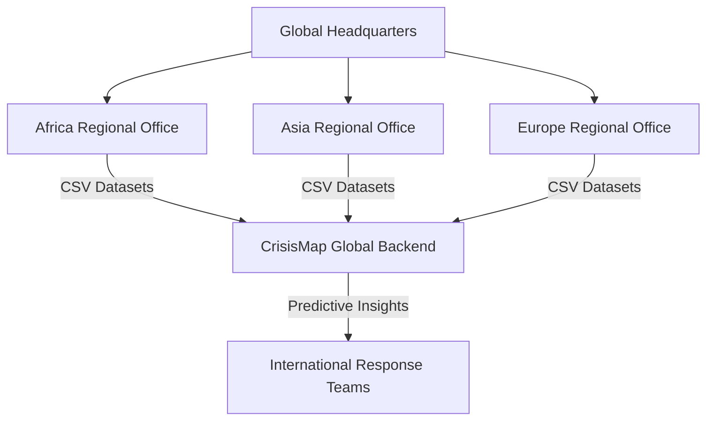
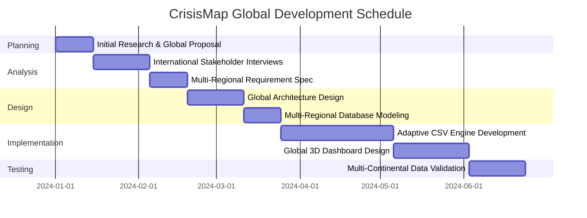

<!-- MKU Project Paper | CrisisMap | Kinga Hinzano | A4 | Times New Roman 12pt | 1.5 spacing -->

# APPENDIX

## A. Global Organisational Structure Diagram
The organizational structure of the International Crisis Monitoring Network (ICMN) was modeled to show the reporting lines from regional offices across the world.

*Figure A.1: Global Organisational Structure Diagram*

...
## D. Global Project Gantt Chart

...
