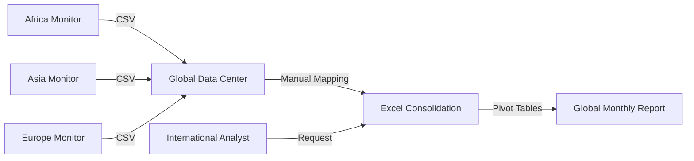

<!-- MKU Project Paper | CrisisMap | Kinga Hinzano | A4 | Times New Roman 12pt | 1.5 spacing -->

# CHAPTER FOUR: SYSTEM ANALYSIS

## 4.2 Analysis of the Current System
The current system used by the ICMN for conflict monitoring was a fragmented process that struggled to harmonize data from diverse global sources. The organization received hundreds of CSV files monthly from monitoring teams across Africa, Asia, and Europe. Each region often used unique data schemas and terminologies, making the manual consolidation of this information into a single global dataset an arduous and error-prone task.

### 4.2.1 Description of Current Operations
The current operations involved a laborious "data cleaning" phase where analysts at the international headquarters would attempt to map disparate regional CSV columns to a central Excel template. For example, a dataset from a partner in Southeast Asia might label location as "Province/City," while a dataset from Eastern Europe might use "District." These inconsistencies required constant manual intervention, leading to significant delays in the reporting cycle. Because there was no automated validation, transcription errors were common, and geographic coordinates were often missing or incorrectly formatted.

The reliance on regional spreadsheets prevented the ICMN from performing any real-time global analysis. Data from Africa was often stored in a different format than data from Europe, creating "data silos" that made it impossible to identify trans-continental conflict trends. Analysts spent the majority of their time on data preparation rather than on strategic analysis or predictive modeling. This systemic inefficiency directly impacted the organization's ability to provide timely alerts to the international humanitarian community, as a global crisis often required a response faster than the manual reporting cycle allowed.

### 4.2.2 Modeling of the Current System
The data flow in the existing system was characterized by manual hand-offs across multiple time zones, introducing significant latency. The following diagram illustrates the flow of information from regional monitors to the final global report.

*Figure 4.1: Data Flow Diagram of Current Manual Global System*

As shown in Figure 4.1, the "Global Data Center" served as a significant bottleneck, as it had to process and harmonize diverse CSV formats from three different continents. This manual process was inherently unscalable and prevented the organization from providing the real-time, predictive intelligence needed for global humanitarian response.
...
