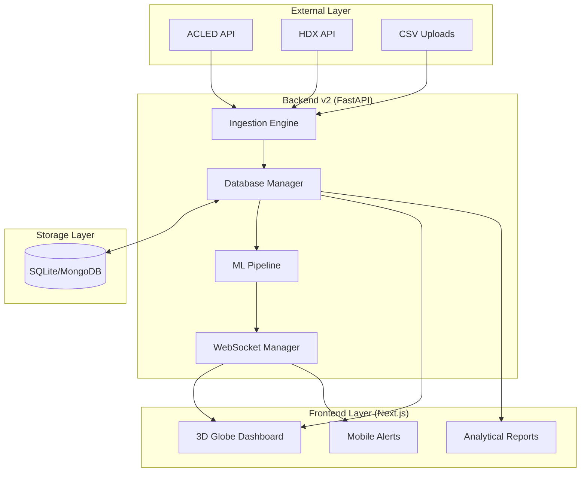
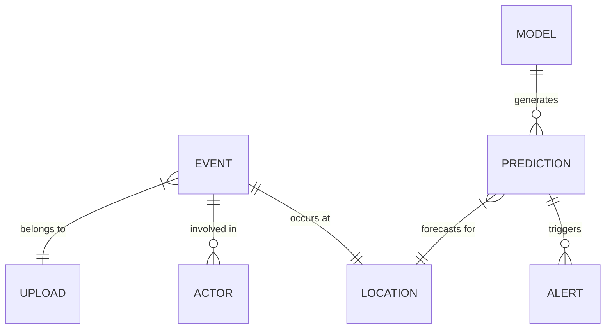
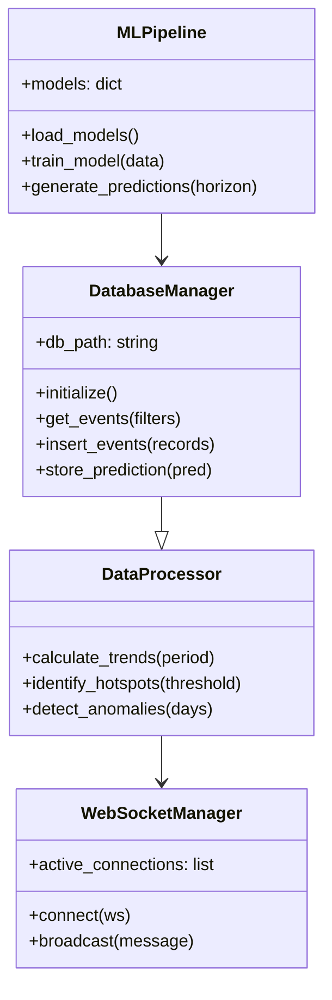
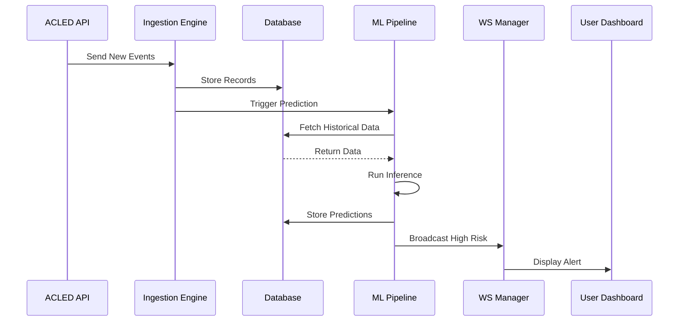

<!-- MKU Project Paper | CrisisMap | Kinga Hinzano | A4 | Times New Roman 12pt | 1.5 spacing -->

# CHAPTER FIVE: SYSTEM DESIGN

## 5.1 Introduction
The system design phase translated the requirements identified during the analysis phase into a detailed technical blueprint. This chapter described the architectural design, the database schema, and the interface models that formed the foundation of the CrisisMap platform. The design focused on modularity, scalability, and high-performance data processing, ensuring that the system could handle the complexities of real-time conflict monitoring. By utilizing modern design patterns and modeling tools, the student created a robust framework that guided the implementation process in Chapter Six.

## 5.2 System Architecture Design
The student adopted a microservices-inspired layered architecture for CrisisMap, which separated the concerns of data ingestion, processing, and visualization. This architecture was chosen to allow for independent scaling of the analytical engine and the frontend dashboard. The system was designed to be containerized using Docker, ensuring consistency across development and production environments.

### 5.2.1 Architectural Overview
The architecture consisted of four primary layers: the Data Source Layer, the Ingestion Layer, the Analytical Layer, and the Presentation Layer. The Data Source Layer included external APIs (ACLED, HDX) and manual CSV uploads. The Ingestion Layer handled the validation and storage of this raw data. The Analytical Layer contained the machine learning pipeline and trend detection algorithms. Finally, the Presentation Layer provided the interactive web and mobile interfaces for the users.

*Figure 5.1: System Architecture Overview*

As illustrated in Figure 5.1, the "Backend v2" served as the central hub of the system, coordinating the flow of information between the storage and presentation layers. The use of WebSockets (via the WebSocket Manager) allowed for real-time communication, ensuring that alerts reached the "Mobile Alerts" component without the need for manual polling.

## 5.3 Database Design
The database was the most critical component of the system design, as it had to support high-velocity writes from the ingestion engine and complex analytical queries from the dashboard. The student designed a hybrid schema that supported both relational (SQLite) and document-based (MongoDB) storage.

### 5.3.1 Conceptual Design (ERD)
The conceptual design focused on the core entities involved in conflict monitoring: events, actors, locations, and predictions. The relationships between these entities were modeled to ensure data integrity and query efficiency.

*Figure 5.2: Entity Relationship Diagram*

The ERD (Figure 5.2) shows that an "EVENT" could involve multiple "ACTOR" entities and was linked to a specific "LOCATION." The "PREDICTION" entity was generated by a "MODEL" and was tied to a "LOCATION" to provide geographic context. This structure allowed analysts to query conflict trends by actor, location, or prediction confidence.

### 5.3.2 Logical and Physical Design
The logical design translated the entities into specific table structures with defined data types and constraints. The primary table, `events`, was designed to store disaggregated conflict data with high precision.

Table 5.1: Database Schema for Conflict Events
The physical design included the implementation of indexes on `event_date`, `country`, and `risk_level` columns to optimize query performance. For the enterprise version, the student implemented a sharding strategy in MongoDB, partitioning the data by `country` to ensure that as the dataset grew, the system remained responsive.

## 5.4 Class Design and Modeling
The backend logic was designed using Object-Oriented Programming (OOP) principles to ensure reusability and maintainability. The core classes included `DatabaseManager`, `MLPipeline`, and `DataProcessor`.

*Figure 5.3: Unified Modelling Language Class Diagram*

The class diagram (Figure 5.3) illustrates the dependencies between the core modules. The `DataProcessor` utilized the `DatabaseManager` to fetch records and then communicated findings to the `WebSocketManager` for real-time broadcasting. The `MLPipeline` was a standalone service that interacted with the database for training and inference.

## 5.5 Process Modeling and Sequence Diagrams
To design the interaction between the different system components, the student modeled the primary processes using sequence diagrams. This was particularly important for the "Prediction and Alerting" workflow, which involved multiple asynchronous steps.

*Figure 5.4: Sequence Diagram for Real-time Prediction and Alerting*

The sequence diagram (Figure 5.4) clearly maps out the automated flow of information. By triggering the "Prediction" immediately after "Store Records," the system ensured that the predictive insights were always synchronized with the latest ground-truth data.

## 5.6 User Interface Design
The interface design focused on "Information Density" and "Visual Hierarchy," ensuring that analysts could identify critical trends at a glance. The student designed a "Strategic Dashboard" that combined high-level metrics with a detailed 3D map.

### 5.6.1 Strategic Dashboard Layout
The dashboard was divided into three primary zones: the "Intelligence Feed" (left), the "3D Geographic Monitor" (center), and the "Predictive Analytics Panel" (right). The center zone utilized Three.js to render a globe where each conflict event was represented by a particle. The color and size of the particle indicated the severity and fatality count of the event.

### 5.6.2 Alert Interface
The alert interface was designed for both web and mobile platforms. When a high-risk prediction was generated, a notification card appeared on the screen, providing a summary of the risk, the location, and a "Confidence Score." This design ensured that users were immediately aware of emerging threats, even when not actively looking at the analytical reports.

## 5.7 Conclusion of System Design
The system design for CrisisMap achieved the goals of modularity and real-time performance. By adopting a layered architecture and a hybrid database approach, the student created a platform that was both flexible and robust. The use of detailed modeling tools, including ERDs, Class Diagrams, and Sequence Diagrams, ensured that the implementation phase had a clear and logical foundation. The design focused not just on technical features but on the user experience, providing an intuitive interface for complex conflict analysis. This comprehensive design served as the final roadmap for building the CrisisMap platform.
