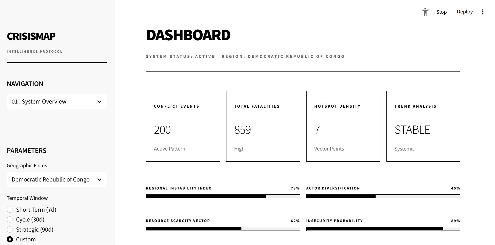
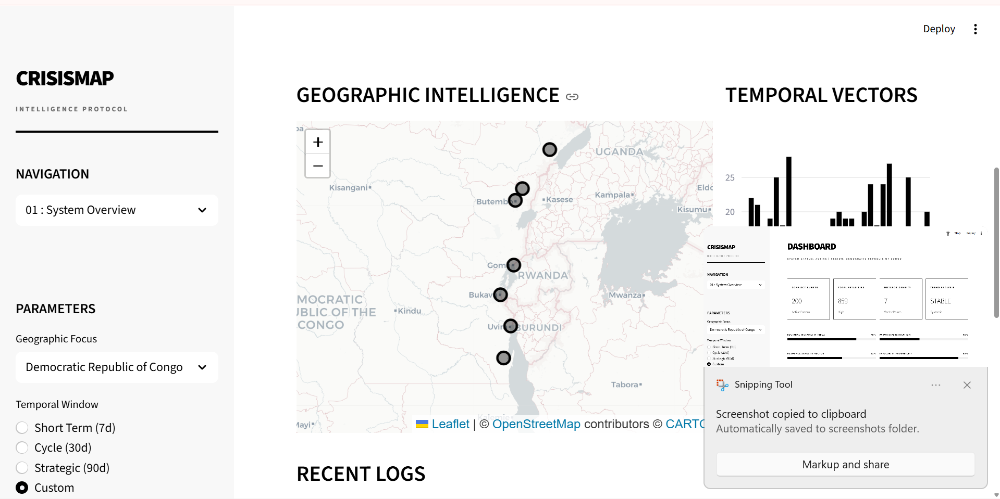
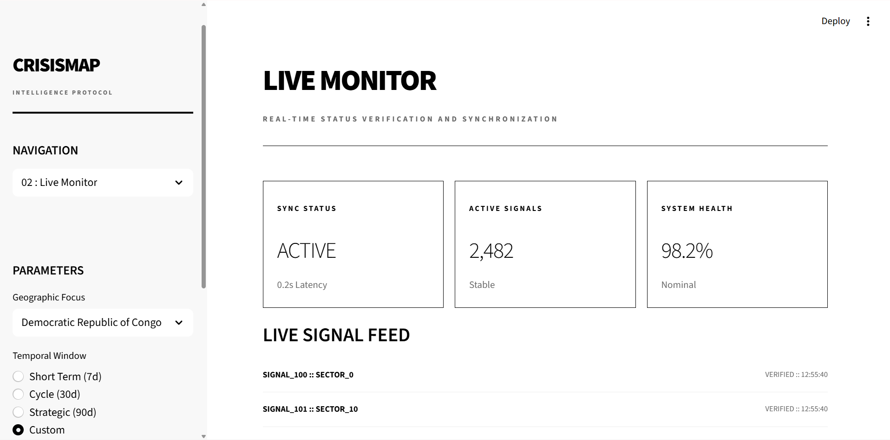
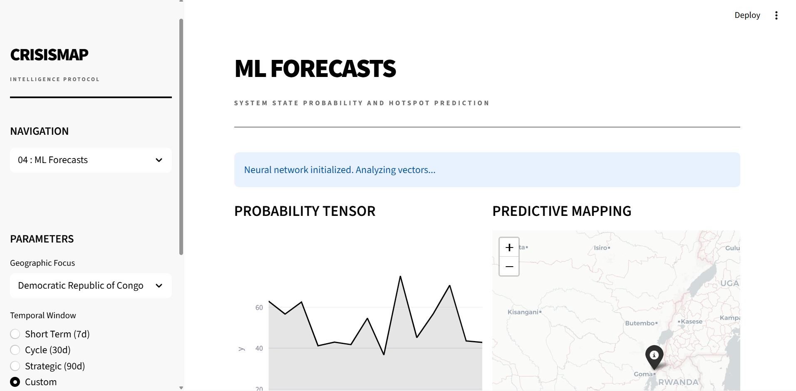
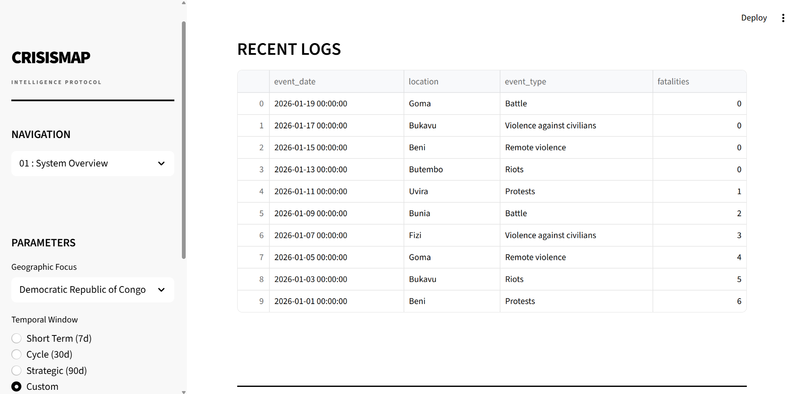

# CrisisMap: Conflict Early Warning and Trend Analysis Platform

CrisisMap is a sophisticated data analytics and visualization platform designed for real-time conflict monitoring, early warning, and strategic analysis in the Great Lakes Region, with a primary focus on Eastern Democratic Republic of the Congo (DRC).

The platform transforms raw conflict data from multiple sources into actionable intelligence for peacebuilding analysts, humanitarian organizations, and policy researchers.

## Core Capabilities

### 1. Multi-Source Data Integration
*   **ACLED Live Sync**: Automated ingestion of the latest conflict event data via the ACLED API.
*   **HDX Humanitarian Data**: Direct integration with OCHA and IOM (International Organization for Migration) for real-time displacement tracking and humanitarian indicators.
*   **CSV Import Utility**: A robust tool to manually import and map historical datasets from local files.
*   **Persistent Storage**: All ingested data is stored in a local SQLite database for high-performance offline analysis.

### 2. Advanced Analytics Layer
*   **Predictive Modeling**: Machine Learning models (Random Forest, Gradient Boosting) that forecast fatality trends and predict potential hotspot migration over a 14-day horizon.
*   **Automated Anomaly Detection**: Statistical and spatial algorithms that identify unusual spikes in violence or geographic shifts in conflict patterns.
*   **Conflict Driver Analysis**: Integrated analysis of socio-economic, climate, and displacement factors to identify the underlying drivers of regional instability.
*   **Actor Network Analysis**: Visualization of actor co-occurrence and influence networks to help identify key spoilers or potential peacebuilding partners.

### 3. Interactive Visualization
*   **Real-Time Monitor**: A live activity feed and dashboard showing the latest reported incidents and risk scores.
*   **Geographic Hotspots**: Interactive Folium maps visualizing conflict density, intensity, and predicted expansion areas.
*   **Temporal Trends**: Deep-dive time series analysis showing seasonal patterns, cycles, and structural breaks in conflict data.

## Technology Stack

*   **Frontend**: Streamlit (Modern UI implementation)
*   **Backend**: FastAPI (Python)
*   **Data Processing**: Pandas, NumPy, Statsmodels
*   **Machine Learning**: Scikit-Learn (Predictive models and Anomaly detection)
*   **Visualizations**: Plotly, Folium, Streamlit-Folium
*   **Database**: SQLAlchemy with SQLite (Local persistence)

## Quick Start Guide

### Prerequisites
*   Python 3.10 or higher (Python 3.12 recommended for stability)

### Installation
1.  **Clone the repository** to your local machine.
2.  **Run the setup script** to create a virtual environment and install all dependencies:
    ```powershell
    .\setup.bat
    ```
3.  **Configure your environment**: Open the `.env` file and add your ACLED API credentials (if available).

### Running the Application
1.  **Start the Backend**:
    ```powershell
    python backend/complete_main.py
    ```
2.  **Start the Frontend**:
    ```powershell
    streamlit run frontend/modern_ui.py
    ```

## Project Structure
*   `backend/`: FastAPI server, data ingestion scripts, and analytical models.
*   `frontend/`: Streamlit modern UI components and page layouts.
*   `data/`: Directory for raw downloads, processed data, and automated exports.
*   `crisismap.db`: Local SQLite database containing all synchronized events and analysis results.

## Target Users
*   **UN Missions and Regional Offices**: For operational awareness and contingency planning.
*   **Humanitarian Teams**: To correlate conflict hotspots with displacement trends for better aid delivery.
*   **Policy Research Teams**: For evidence-based analysis of conflict drivers and seasonal trends.

## Data Sources

CrisisMap provides a unified intelligence layer by aggregating data from the world's leading conflict and humanitarian monitoring bodies:

1.  **ACLED (Armed Conflict Location & Event Data Project)**: The gold standard for conflict monitoring. We ingest disaggregated event data, including specific dates, actors, and verified fatalities for the Great Lakes region.
2.  **HDX (Humanitarian Data Exchange)**: We utilize the OCHA-managed HDX API to retrieve localized humanitarian indicators that correlate with conflict activity.
3.  **UN OCHA (Office for the Coordination of Humanitarian Affairs)**: Provides structural data on displacement site assessments and urgent situational reports for the DRC and neighboring states.
4.  **IOM DTM (International Organization for Migration - Displacement Tracking Matrix)**: Our primary source for tracking the movement of internally displaced persons (IDPs) and returnees across contested borders.

## Application Interface

Below are snapshots of the current minimalist black-and-white interface:

### 1. Strategic Dashboard
Overview of regional instability, conflict density, and systemic trends.


### 2. Geographic Intelligence
Interactive mapping of conflict clusters and temporal vector analysis.


### 3. Live Monitor
Real-time signal verification and system health tracking.


### 4. ML Forecasts
Predictive modeling of fatalities and potential hotspot migration.


### 5. Intelligence Logs
Disaggregated event records for deep-dive investigation.


---
CrisisMap is designed to provide a robust, data-driven foundation for peacebuilding and humanitarian response in the Great Lakes Region.